# LoadCell-HX711-YOLOv5-n8n-Raspberry-Pi-CM4


-orange)

Timbangan digital IoT untuk digitalisasi penimbangan komoditas sayuran di pasar tradisional. Sistem mengakuisisi data berat menggunakan sensor **load cell strain gauge 180 kg** + ADC **HX711 24-bit**, mengidentifikasi jenis sayuran (wortel, tomat, kentang) secara otomatis menggunakan model **YOLOv5n** berbasis *computer vision* (*edge computing* TFLite FP16), lalu mencatat data secara *real-time* ke **Google Sheets** serta menyediakan **notifikasi & chatbot WhatsApp berbasis AI** melalui *workflow* otomasi **n8n**.

---

## Daftar Isi
- [Fitur Utama](#-fitur-utama)
- [Arsitektur Sistem](#-arsitektur-sistem)
- [Kebutuhan Hardware](#-kebutuhan-hardware)
- [Kebutuhan Software & Library](#-kebutuhan-software--library)
- [Struktur Folder Repositori](#-struktur-folder-repositori)
- [Panduan Instalasi & Menjalankan Sistem](#-panduan-instalasi--menjalankan-sistem)
- [Cara Penggunaan](#-cara-penggunaan)
- [Dokumentasi Pengujian & Hasil](#-dokumentasi-pengujian--hasil)
- [Kontribusi & Lisensi](#-kontribusi--lisensi)
- [Kontak / Penulis](#-kontak--penulis)

---

## Arsitektur Sistem

Sistem menggunakan pendekatan **Input → Proses → Output**: *load cell* + HX711 (berat) dan webcam (citra) sebagai masukan; Raspberry Pi CM4 menjalankan konversi berat, filtering, dan inferensi YOLOv5n; keluaran ditampilkan di LCD 16×2 lalu ditransmisikan ke Google Sheets dan diteruskan ke WhatsApp.

**Diagram Blok Sistem**
<p align="center">
  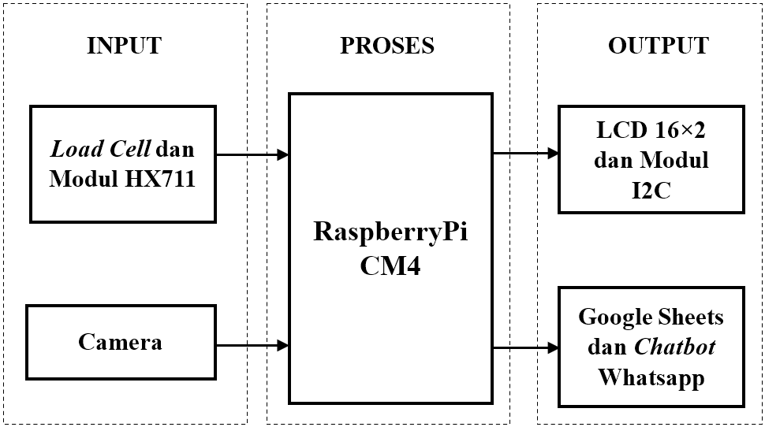
</p>

**Flowchart Sistem Keseluruhan**
<p align="center">
  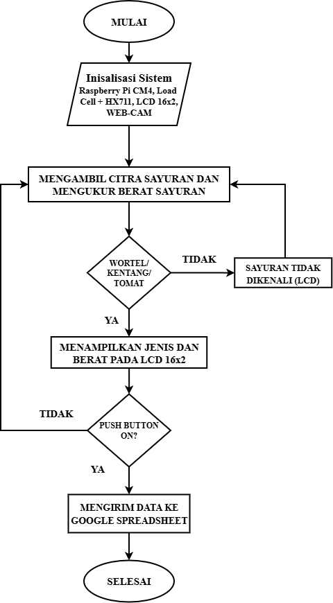
</p>

**Rangkaian & pengkabelan**

| Skematik Keseluruhan | Diagram Pengawatan | Desain PCB (Single Side) |
|---|---|---|
| 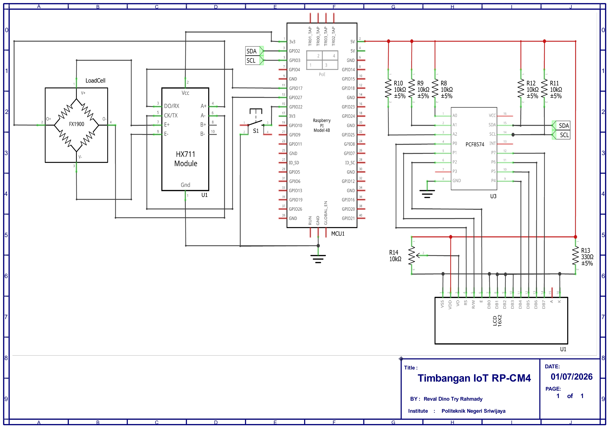 | 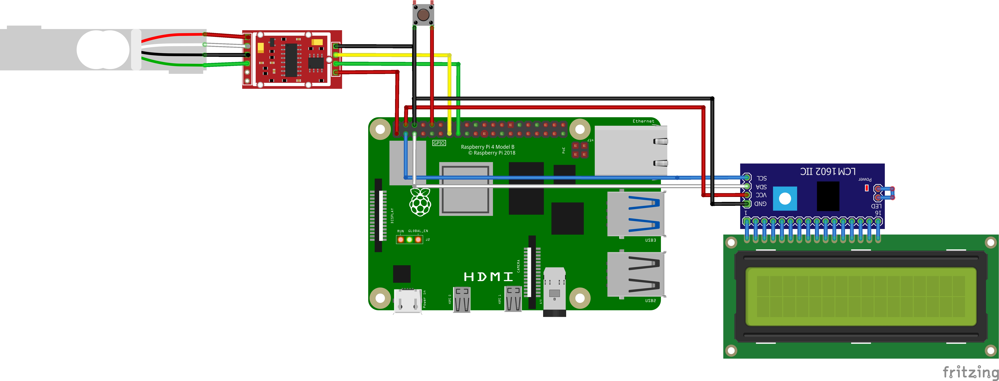 | 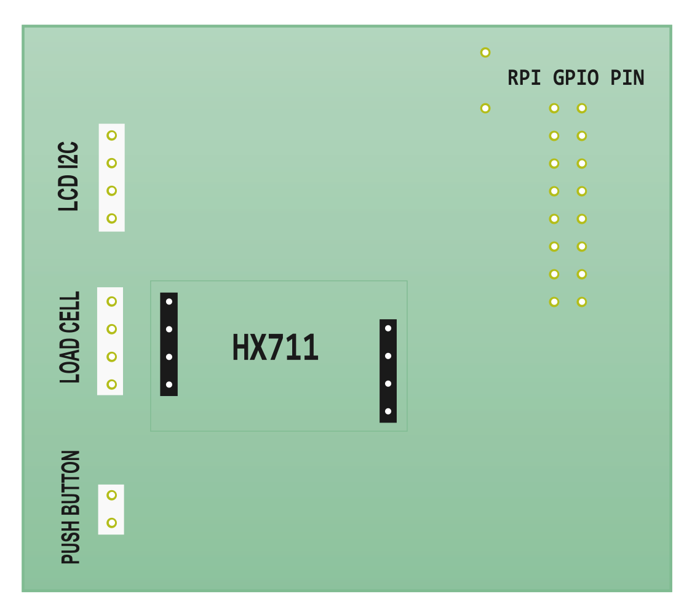


**Desain mekanik & hasil rakitan**

| Sketsa 3D | Hasil Perancangan Alat |
|---|---|
| 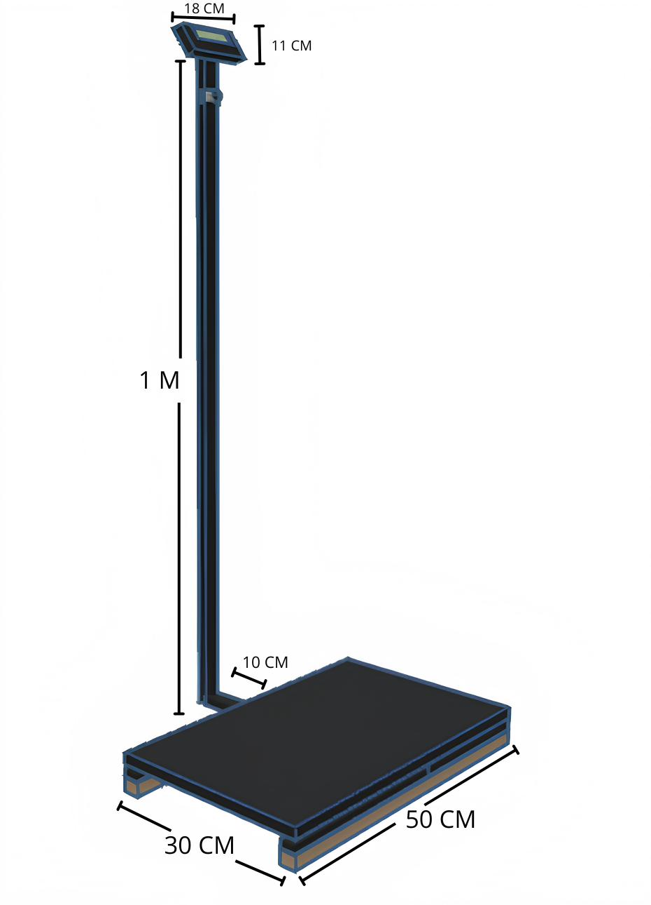 | 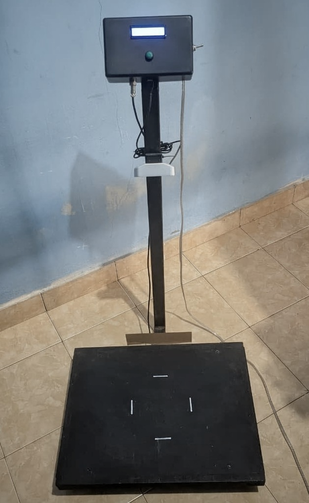 |

## Hardware

| Komponen | Spesifikasi |
|---|---|
| Sensor berat | Load cell strain gauge (Wheatstone full bridge) 180 kg, output 1,0–2,0 mV/V |
| Modul ADC | HX711, 24-bit |
| Unit pemrosesan | Raspberry Pi Compute Module 4 (64-bit, RAM 2 GB LPDDR4, eMMC 32 GB) + papan ekspansi CM4 I/O Base-A |
| Sensor visual | Webcam USB (Micropack 1080p) |
| Display | LCD 16×2 + modul I2C PCF8574 (alamat 0x27), 5V |
| Input pengguna | Push button NO aktif rendah (GPIO22) + toggle switch on/off |
| Catu daya | Adaptor 5 VDC / 3 A (input 110–220 VAC) |
| Konektivitas | Modem Wi-Fi (jaringan lokal) |
| PCB | Single side (jalur HX711, konektor load cell, LCD I2C, header GPIO) |
| Mekanik | Kerangka besi hollow 3 mm (rangka atas & bawah), alas triplek 50 × 30 cm, tinggi ±1 m; box komponen 18,5 × 11,4 × 6,4 cm |

---

## Software & Library
**Struktur Proyek**
```
Timbangan-IoT/
├── firmware/                  # Kode Python yang berjalan di Raspberry Pi CM4
│   ├── main.py                # Program utama terintegrasi (berat + jenis + LCD + kirim)
│   ├── thread_berat.py        # Thread pembacaan berat (HX711 + filter Stable Lock)
│   ├── thread-jenis.py        # Thread deteksi jenis sayur (YOLOv5 TFLite + webcam)
│   ├── kalibrasi.py           # Skrip kalibrasi load cell (menentukan CALIBRATION_FACTOR)
│   └── uji_sistem.py          # Program uji akurasi, presisi & stabilitas
├── model/
│   └── best-fp16.tflite       # Model YOLOv5n hasil konversi TFLite FP16
├── cloud/
│   ├── pb_to_sheets.gs        # Google Apps Script (doPost → Sheets + foto ke Drive)
│   └── n8n/
│       └── manajemen-stok-sayur-whatsapp-pin.json   # Workflow n8n chatbot WhatsApp + PIN
├── hardware/                  # Skematik, PCB, dan diagram pengawatan (file desain)
├── docs/
│   ├── laporan/               # Laporan akhir kedua subsistem (.docx)
│   └── images/
│       ├── diagram/           # Diagram blok & flowchart
│       ├── wiring/            # Skematik, pengawatan, desain PCB
│       ├── alat/              # Sketsa 3D & foto fisik alat
│       └── hasil/             # Grafik pengujian, deteksi, chatbot, spreadsheet
└── README.md
```
**Alur pelatihan model deteksi jenis sayur (subsistem computer vision):**
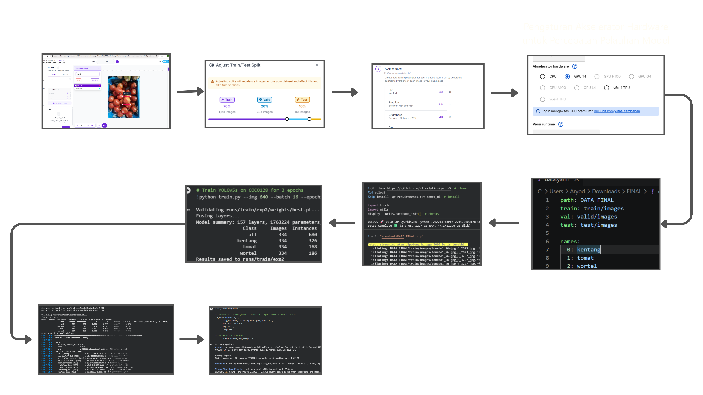

Diagram di atas merangkum alur pelatihan model YOLOv5 untuk deteksi jenis sayur:

**1. Anotasi dataset di Roboflow**
Gambar sayuran diberi label (*bounding box*) dengan kelas seperti tomat, kentang, dan wortel menggunakan Annotation Editor.

**2. Pembagian dataset (Train/Test Split)** 
Dataset dibagi menjadi 70% data latih (1.168 gambar), 20% validasi (334 gambar), dan 10% pengujian (166 gambar).

**3. Augmentasi data** 
Menambah variasi data latih dengan teknik seperti *flip* vertikal, rotasi (−15° hingga +15°), dan *brightness* (−20% hingga +20%) agar model lebih tangguh.

**4. Pengaturan akselerator hardware** 
Di Google Colab, *runtime* diatur menggunakan GPU T4 untuk mempercepat proses pelatihan.

**5. Konfigurasi `data.yaml`** 
Menentukan *path* dataset (`train`/`valid`/`test` images) serta daftar kelas: `0 = kentang`, `1 = tomat`, `2 = wortel`.

**6. Persiapan lingkungan pelatihan** 
Meng-*clone* repositori YOLOv5 dari GitHub, menginstal *requirements* (termasuk `comet_ml`), lalu meng-*unzip* dataset (`DATA FINAL.zip`) ke lingkungan Colab.

**7. Pelatihan model** — Menjalankan `train.py` dengan parameter seperti ukuran gambar 640, *batch* 16, dan sejumlah *epoch*. Hasil pelatihan dan bobot terbaik (`best.pt`) disimpan di `runs/train/exp2`.

**8. Validasi dan ekspor model** 
Model divalidasi (menghasilkan metrik seperti mAP, *precision*, *recall* per kelas), lalu diekspor ke format TFLite menggunakan `export.py` agar bisa digunakan di perangkat *mobile*/*embedded*.

**Alur perancangan software (subsistem akuisisi berat):**
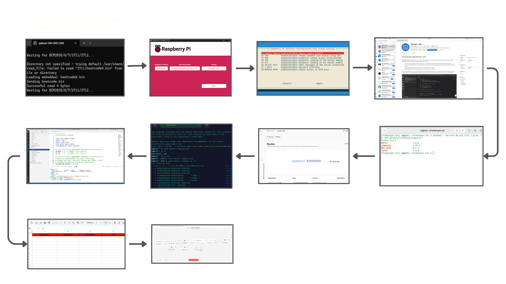

**1. Flash OS ke eMMC CM4**
Geser sakelar board I/O ke mode *boot* USB-C, hubungkan ke komputer, jalankan `rpiboot` agar eMMC terbaca sebagai drive, lalu tulis OS (Raspberry Pi OS / Ubuntu Server 22.04) beserta konfigurasi SSH menggunakan **Raspberry Pi Imager**. Kembalikan sakelar ke mode normal dan nyalakan ulang.

**2. Konfigurasi awal sistem**
Jalankan `sudo raspi-config` untuk mengaktifkan **SSH** dan antarmuka **I2C**/SPI, atur Wi-Fi, zona waktu, dan hostname.

**3. Hubungkan VS Code Remote-SSH** ke Raspberry Pi untuk pengembangan headless.

**4. Clone repositori** pada direktori proyek:
   ```bash
   git clone https://github.com/revaldinotr/timbangan-iot-rp4
   cd timbangan-iot-rp4
   ```
**5. Buat lingkungan virtual Python** (opsional, tetapi disarankan):
  ```bash
    python3 -m venv venv
  ```
- Aktifkan lingkungan virtual:
```bash
  source venv/bin/activate
```

**6. Instal dependensi yang diperlukan menggunakan pip3** :
```bash
  pip3 install -r requirements.txt
```

**7. Rakit perangkat keras** sesuai diagram pengawatan (HX711 → GPIO17/27, LCD I2C → SDA/SCL, push button → GPIO22, webcam → USB).

**7. Kalibrasi load cell** :
   ```bash
   python kalibrasi.py
   ```
   Ikuti instruksi (tare kosong → letakkan beban acuan 1,00 kg → catat `CALIBRATION_FACTOR`), lalu masukkan nilainya ke konfigurasi script utama.
   
**9. Deploy Google Apps Script**

  salin `IoT/pb_to_sheets.gs` ke proyek Apps Script yang terikat pada Google Sheets, *deploy* sebagai *web app*, lalu isi `GOOGLE_SHEETS_SCRIPT_ID` pada konfigurasi firmware.

**10. Siapkan n8n + Cloudflare Tunnel** :

  instal Docker (`curl` installer, `sudo usermod -aG docker $USER`), jalankan container n8n, buat *tunnel* di dashboard Cloudflare Zero Trust (Networks → Tunnels), arahkan *public hostname* ke port n8n, dan jalankan perintah konektor di terminal Raspberry Pi.

**10. Import workflow n8n** :

  impor `IoT/n8n/manajemen-stok-sayur-whatsapp-pin.json`, konfigurasi kredensial Fonnte API, Google Sheets, dan Groq.

**11. (Opsional) Verifikasi karakteristik sensor**:
    ```bash
    python3 firmware/uji_sistem.py   # Mode 1: Akurasi & Presisi | Mode 2: Stabilitas
    ```

**12. Jalankan program utama**:
    ```bash
    python3 firmware/main.py
    ```
    Catatan: setelah perangkat menyala, seluruh layanan (boot OS, container n8n, Cloudflare Tunnel) membutuhkan ±2 menit hingga chatbot siap merespons.

---

## SOP (*Standar Operasional Prosedur*) alat 

1. Aktifkan **toggle switch** Power Supply sehingga Raspberry Pi CM4 booting dan otomatis menjalankan skrip serta layanan n8n.
3. Letakkan sayuran di atas platform timbangan (titik uji di tengah alas, area bertanda). Load cell membaca berat, webcam memindai jenis sayuran; jika objek tidak dikenali, sistem memindai ulang.

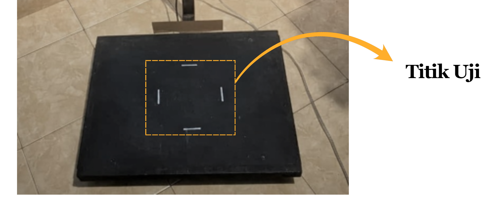

<p align="center">
  
</p>

5. LCD 16×2 menampilkan hasil, misal `Berat: 6.93 KG` dan `Jenis: Tomat`; nilai berat terkunci otomatis saat stabil (`>> STABIL <<`).
6. Tekan **push button** untuk mengirim data, sehingga LCD menampilkan `Mengirim data.. / Mohon tunggu...`, lalu konfirmasi `TERKIRIM + FOTO!` setelah berat, jenis, dan foto tersimpan di Google Sheets & Drive.
7. Pantau stok jarak jauh via **chatbot WhatsApp**: ketik `LOGIN`, masukkan **PIN** (sesi aktif 60 menit), lalu tanyakan stok, total berat masuk, jenis sayur per hari, kalkulasi pendapatan, atau minta lampiran foto produk.

---

## Dokumentasi Pengujian & Hasil

### 1. Kalibrasi Load Cell
| Parameter | Nilai |
|---|---:|
| Nilai ADC tanpa beban (tare) | 392.468 |
| Nilai ADC beban acuan | 416.653 |
| Selisih nilai ADC (N benda - N tare) | 24.185 |
| Sensitivitas Aktual | 2,0272 mV/V |
| Massa beban acuan | 1.000 gram (1,00 kg) |
| Faktor kalibrasi (k) | 24,1850 |

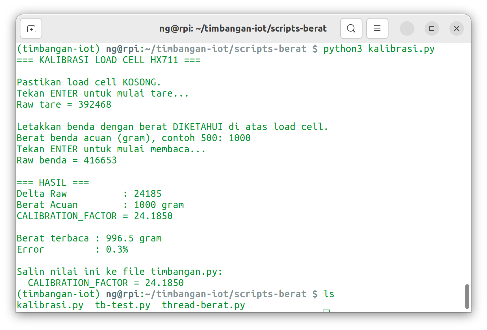

### 2. Uji Akurasi & Presisi (7 beban × 10 pengulangan)

| Ref (kg) | Mean (kg) | Error (%) | Std (kg) | RSD (%) | Akurasi (%) |
|---:|---:|---:|---:|---:|---:|
| 1,00 | 1,00 | 0,50 | 0,0053 | 0,52 | 99,50 |
| 5,00 | 5,01 | 0,12 | 0,0052 | 0,10 | 99,88 |
| 10,00 | 10,01 | 0,09 | 0,0032 | 0,03 | 99,91 |
| 15,00 | 14,99 | 0,05 | 0,0048 | 0,03 | 99,95 |
| 20,00 | 20,01 | 0,05 | 0,0057 | 0,03 | 99,95 |
| 25,00 | 25,01 | 0,04 | 0,0057 | 0,02 | 99,96 |
| 30,00 | 30,01 | 0,02 | 0,0165 | 0,05 | 99,98 |

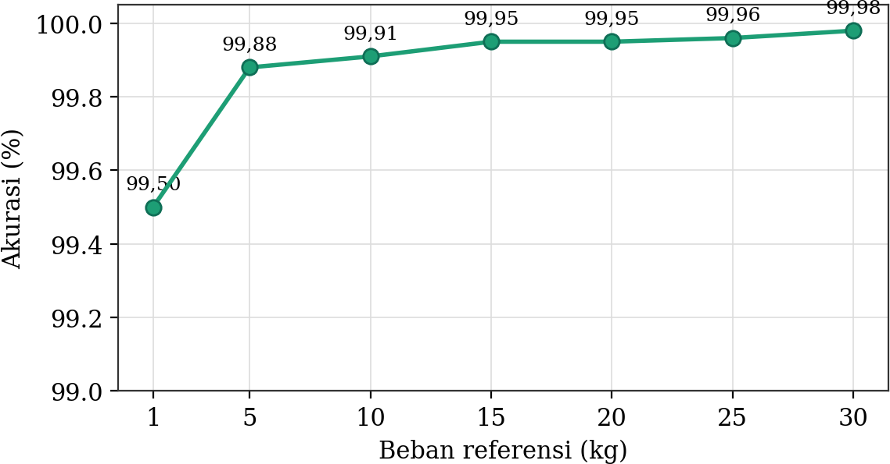
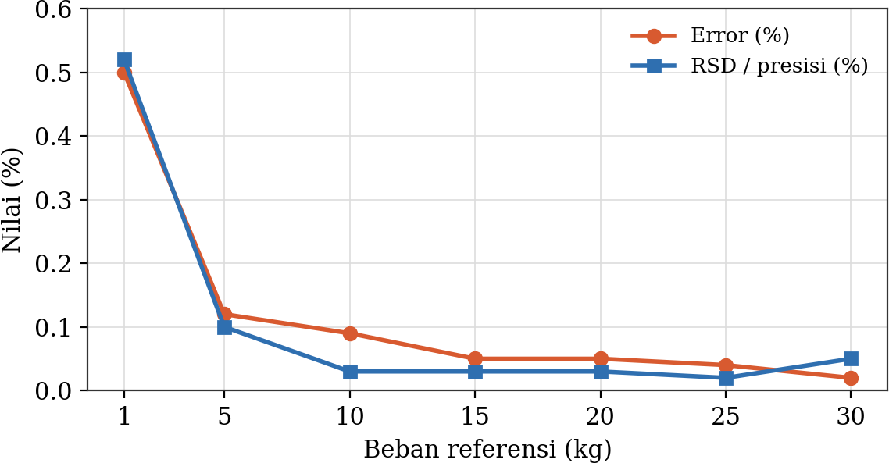

### 3. Uji Stabilitas (beban konstan 5–30 menit)
Drift maksimum 0,01–0,02 kg, tanpa pergeseran permanen (*no permanent drift / creep*); RSD 0,0229%–0,4816%; akurasi 99,70%–99,99%.

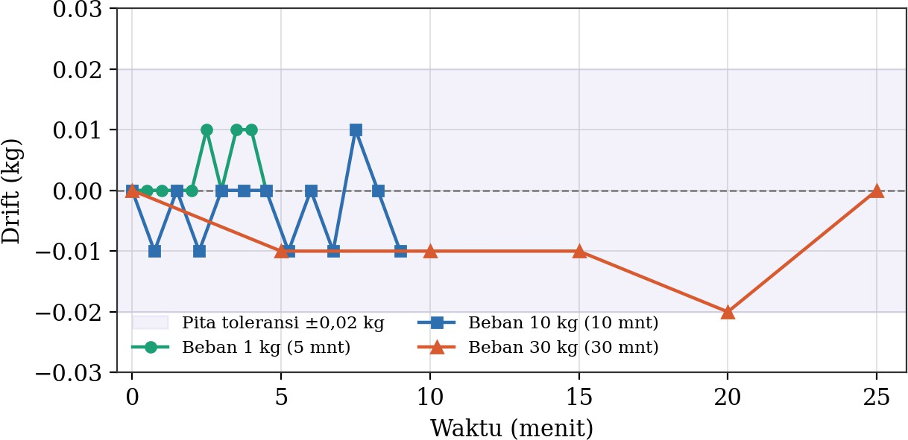
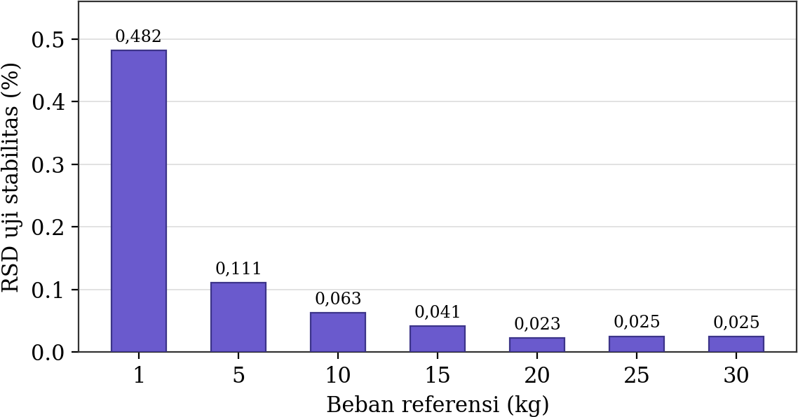

### 4. Pelatihan & Deteksi YOLOv5n
Dataset 1.668 gambar (kentang 575, tomat 684, wortel 409), 200 epoch, evaluasi pada 167 gambar validasi:

| Kelas | Precision | Recall | mAP50 |
|---|---:|---:|---:|
| Kentang | 74,3% | 79,1% | 83,7% |
| Tomat | 93,2% | 97,7% | 98,3% |
| Wortel | 73,8% | 69,9% | 72,1% |
| **Keseluruhan** | **80,4%** | **82,2%** | **84,7%** |

Deteksi *real-time* (TFLite FP16 di CM4): **48/60 percobaan berhasil (80%)**, confidence rata-rata 80,6%, kecepatan **10-20 FPS** — tomat 90%, kentang 80%, wortel 70%.

<p align="center">
  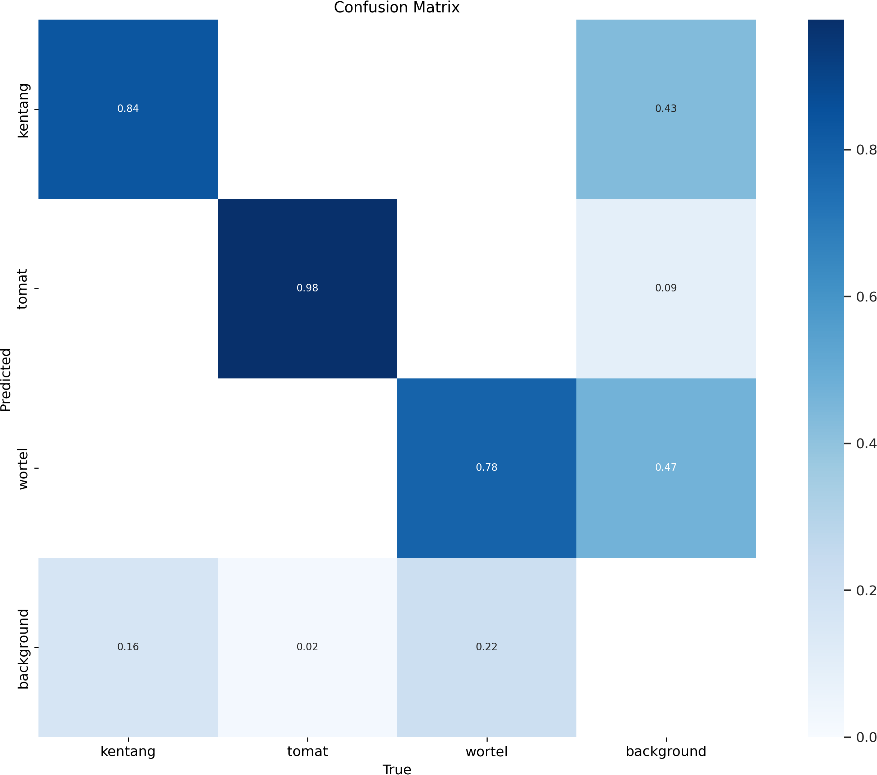
</p>
<p align="center">
  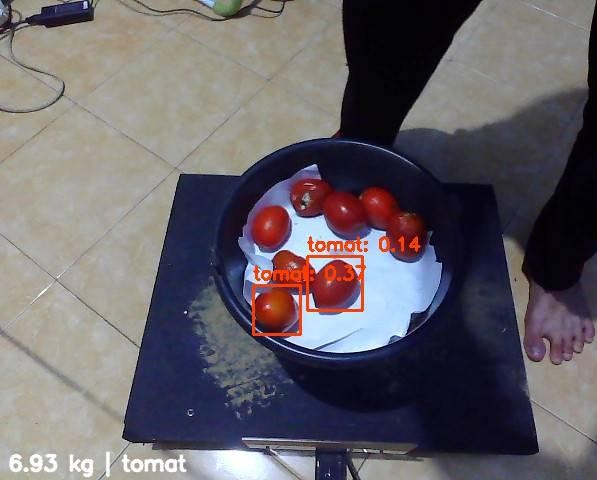
</p>


### 5. Integrasi Cloud & Chatbot
Pengujian dilakukan dengan menempatkan sampel sayuran di atas timbangan, menunggu LCD menampilkan pembacaan yang stabil, lalu menekan tombol pengiriman. Alur tampilan LCD berlangsung tiga tahap: kondisi awal (`Berat: 6.93 KG` / `Jenis: Tomat`) → status unggah (`Mengirim data.. / Mohon tunggu...`) saat berat, jenis, dan foto tangkapan kamera diunggah ke Google Apps Script → konfirmasi berhasil (`TERKIRIM + FOTO! 6.9kg Tomat`). Hasil: **13/15 percobaan berhasil** (waktu kirim 2–6 detik; kegagalan hanya terjadi saat Wi-Fi terputus/tidak stabil).

| Tampilan LCD (Berat & Jenis) | Proses Pengiriman | Berhasil Terkirim |
|:---:|:---:|:---:|
| 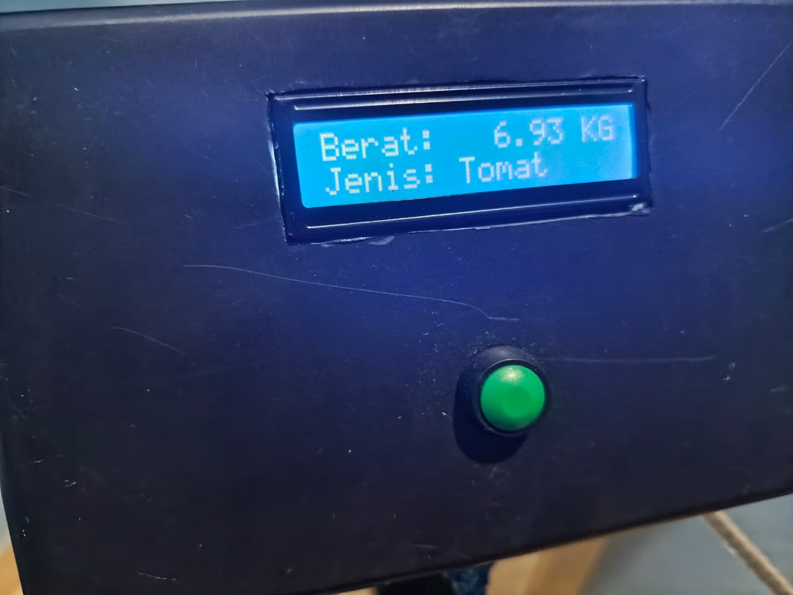 | 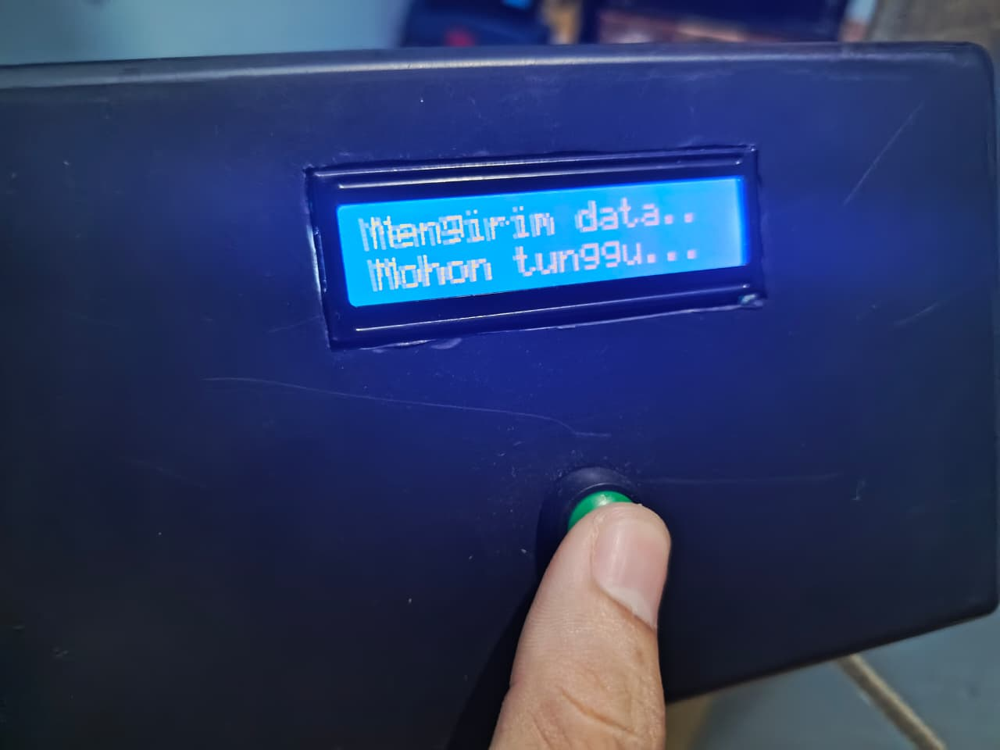 | 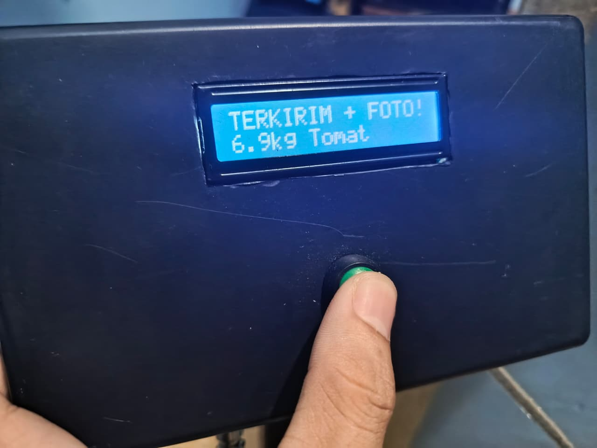 |

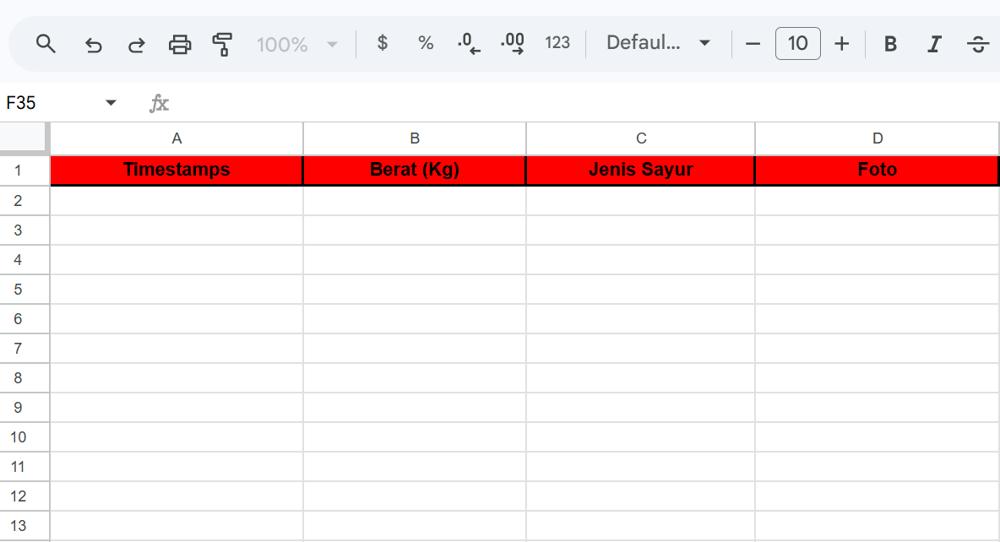

Data stok sayur di Google Sheets diakses otomatis oleh workflow n8n melalui Google Sheets API setiap kali pengguna mengirim pertanyaan ke chatbot WhatsApp, sehingga jawaban LLM selalu berdasarkan kondisi stok terkini. Antarmuka workflow n8n ini dirancang dengan mengintegrasikan Fonnte API, webhook n8n, Google Sheets, autentikasi PIN, dan Groq LLaMA 3.3 70B.

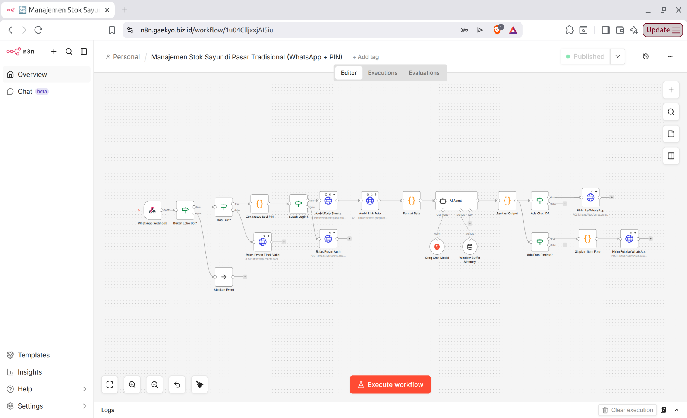

Saat Raspberry Pi baru terhubung ke daya dan Wi-Fi, sistem menjalani proses inisialisasi yang mencakup *booting* OS, *starting* *Docker container* n8n, hingga pembentukan koneksi Cloudflare Tunnel, dengan total *delay* sekitar ±2 menit sebelum sistem siap digunakan. Kondisi ini terkonfirmasi pada pengujian, di mana pesan yang dikirim pukul 9.18 pm dan 9.19 pm baru mendapatkan respons pada pukul 9.20 pm. Respons yang muncul kemudian menampilkan alur autentikasi PIN secara lengkap, mulai dari notifikasi bahwa pengguna belum *login*, instruksi untuk mengetik `LOGIN`, permintaan PIN, hingga konfirmasi *login* berhasil dengan sesi aktif selama 60 menit.

<p align="center">
  
</p>

*Chatbot* yang dikembangkan mampu:
- menjawab ketersediaan stok sayur secara *real-time*, lengkap dengan detail berat dan *timestamp* pencatatan;
- memahami pertanyaan lanjutan, seperti menghitung total berat masuk, mengidentifikasi jenis sayur pada hari tertentu, hingga mengkalkulasi potensi pendapatan ketika pengguna menyertakan harga jual;
- menjaga batas data dengan menjawab secara jujur ketika pertanyaan berada di luar cakupan *spreadsheet* (misalnya harga beli atau keuntungan), sembari menawarkan alternatif perhitungan yang relevan;
- mengirim foto produk dari Google Drive beserta daftar stok lengkap ketika diminta oleh pengguna.

| Uji Respons #1 | Uji Respons #2 | Uji Respons #3 |
|:---:|:---:|:---:|
|  | 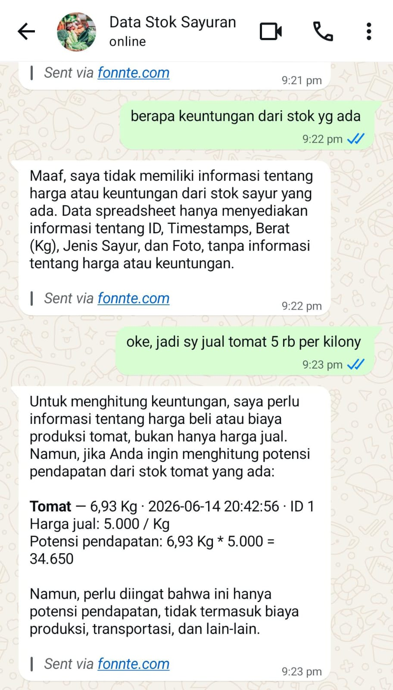 | 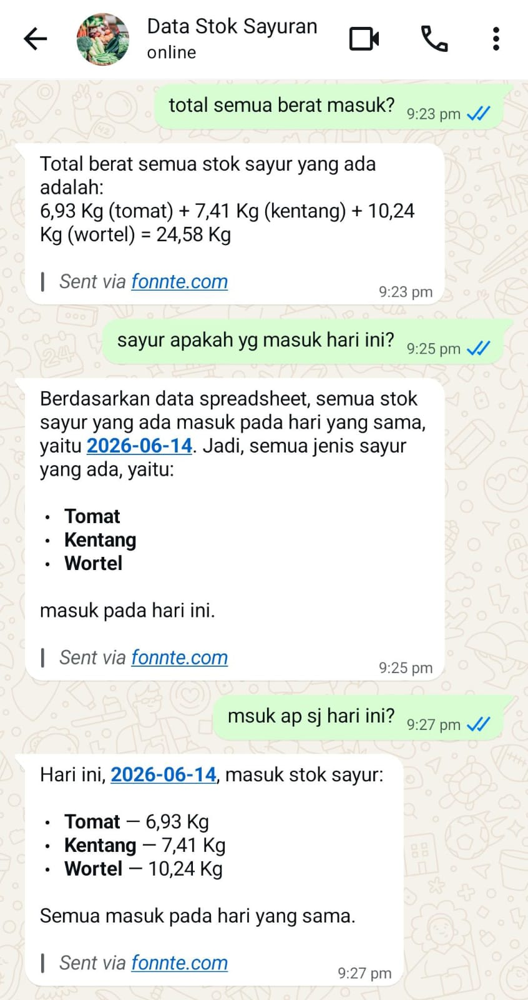 |


---

## Kontribusi & Lisensi

Kontribusi terbuka untuk pengembangan lanjutan, antara lain (sesuai saran laporan): pengujian langsung di lingkungan pasar tradisional, perluasan uji beban hingga kapasitas 180 kg, peredam getaran mekanik pada dudukan load cell, upgrade ke Raspberry Pi 5 (RAM 4–8 GB), perluasan/penyeimbangan dataset (wortel & kentang), penerapan *focal loss*, migrasi ke YOLOv8/YOLOv11, mekanisme antrian data lokal saat koneksi terputus, deteksi kualitas/kesegaran sayuran, serta dashboard web/aplikasi mobile untuk manajemen stok.

Silakan *fork* repositori ini, buat *branch* fitur, lalu ajukan *pull request*.

Proyek ini merupakan **karya Tugas Akhir akademik** Politeknik Negeri Sriwijaya dan dipublikasikan untuk tujuan **pendidikan dan referensi**. Mohon cantumkan atribusi kepada penulis saat menggunakan kode maupun dokumentasi dari repositori ini.

---

## Penulis
<table>
  <thead>
    <tr>
      <th align="center">Foto</th>
      <th align="left">Penulis</th>
      <th align="left">Subsistem</th>
    </tr>
  </thead>
  <tbody>
    <tr>
      <td align="center"></td>
      <td align="left"><a href="https://www.linkedin.com/in/revaldino"><b>Reval Dino Try Rahmady</b></a></td>
      <td align="left">Sistem Akuisisi Data Berat (Load Cell + HX711 + IoT)</td>
    </tr>
    <tr>
      <td align="center"></td>
      <td align="left"><a href="https://www.linkedin.com/in/aryo-dwi-cahyo-94566a3a5"><b>Aryo Dwi Cahyo</b></a></td>
      <td align="left">Penyortir Cerdas Jenis Sayuran (YOLOv5n + Computer Vision)</td>
    </tr>
  </tbody>
</table>


🔗 Repositori: [github.com/revaldinotr/timbangan-iot-rp4](https://github.com/revaldinotr/timbangan-iot-rp4)
