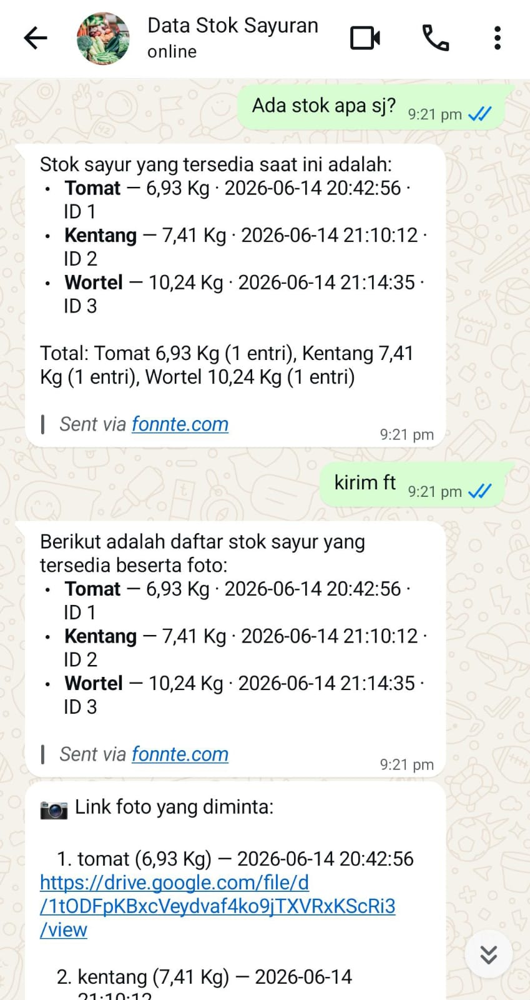
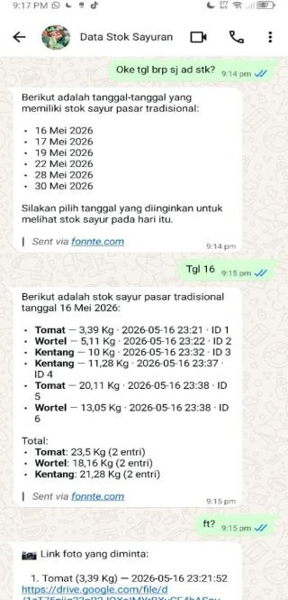

# Timbangan-IoT 🥕⚖️

**Sistem Akuisisi Data Berat & Penyortir Cerdas Jenis Sayuran Berbasis Raspberry Pi CM4**


-orange)

Timbangan digital IoT untuk digitalisasi penimbangan komoditas sayuran di pasar tradisional. Sistem mengakuisisi data berat menggunakan sensor **load cell strain gauge 180 kg** + ADC **HX711 24-bit**, mengidentifikasi jenis sayuran (wortel, tomat, kentang) secara otomatis menggunakan model **YOLOv5n** berbasis *computer vision* (*edge computing* TFLite FP16), lalu mencatat data secara *real-time* ke **Google Sheets** serta menyediakan **notifikasi & chatbot WhatsApp berbasis AI** melalui *workflow* otomasi **n8n**.

---

## 📑 Daftar Isi
- [Fitur Utama](#-fitur-utama)
- [Arsitektur Sistem](#-arsitektur-sistem)
- [Kebutuhan Hardware](#-kebutuhan-hardware)
- [Kebutuhan Software & Library](#-kebutuhan-software--library)
- [Struktur Folder Repositori](#-struktur-folder-repositori)
- [Panduan Instalasi & Menjalankan Sistem](#-panduan-instalasi--menjalankan-sistem)
- [Cara Penggunaan](#-cara-penggunaan)
- [Dokumentasi Pengujian & Hasil](#-dokumentasi-pengujian--hasil)
- [Kontribusi & Lisensi](#-kontribusi--lisensi)
- [Kontak / Penulis](#-kontak--penulis)

---

## ✨ Fitur Utama

- **Penimbangan presisi tinggi** — akurasi 99,50%–99,98% (rentang uji 1–30 kg), RSD < 1%, drift terjaga dalam pita ±0,02 kg, dengan faktor kalibrasi 24,1850 count/gram.
- **Filter berat ala timbangan komersial** — *trimmed median sampling*, *rolling median*, *deadband*, dan mekanisme **Stable Lock** yang mengunci nilai saat pembacaan stabil.
- **Identifikasi jenis sayuran otomatis** — YOLOv5n (dilatih 1.668 gambar, 200 epoch di Google Colab via Roboflow), dikonversi ke TFLite FP16; akurasi deteksi *real-time* 80% pada 3–5 FPS di CPU ARM Cortex-A72.
- **Tampilan lokal LCD 16×2 I2C** — berat, jenis sayuran, dan status pengiriman secara sinkron.
- **Pengiriman data satu tombol** — *push button* (NO aktif rendah) memicu pengiriman berat, jenis, dan foto ke Google Sheets + Google Drive melalui Google Apps Script (latensi 2–6 detik).
- **Chatbot WhatsApp berbasis AI** — alur WhatsApp → Fonnte API → n8n → Google Sheets → Groq (LLaMA 3.3 70B) → WhatsApp, dilengkapi autentikasi **PIN** dengan sesi 60 menit, mampu menjawab pertanyaan stok, kalkulasi total berat, hingga mengirim foto produk dari Drive.
- **Operasi headless** — pengembangan & pemeliharaan jarak jauh via SSH (VS Code Remote-SSH), n8n berjalan lokal dalam Docker dan diekspos publik via Cloudflare Tunnel.

---

## 🏗 Arsitektur Sistem

Sistem menggunakan pendekatan **Input → Proses → Output**: *load cell* + HX711 (berat) dan webcam (citra) sebagai masukan; Raspberry Pi CM4 menjalankan konversi berat, filtering, dan inferensi YOLOv5n; keluaran ditampilkan di LCD 16×2 lalu ditransmisikan ke Google Sheets dan diteruskan ke WhatsApp.


**Rangkaian & pengkabelan:**

| Skematik Keseluruhan | Diagram Pengawatan | Desain PCB (Single Side) |
|---|---|---|
|  | 
```
                    3V3  (1) (2)  5V  ← LCD & HX711 VCC
           SDA1 GPIO2  (3) (4)  5V
           SCL1 GPIO3  (5) (6)  GND  ← HX711 & LCD GND
                      (7) (8)
              GND (9)(10)
                     (11)(12)  GPIO18  ← HX711 DT/DOUT
                     (13)(14)  GND     ← Button GND
                     (15)(16)  GPIO23  ← Push Button
                     (17)(18)
                     (19)(20)
                     (21)(22)
                     (23)(24)
              GND   (25)(26)
                     (27)(28)
                     (29)(30)
                     (31)(32)
    HX711 SCK GPIO19 (35)(34)  GND
```|  |

Koneksi utama: HX711 `DOUT → GPIO17`, `SCK → GPIO27`; LCD 16×2 via ekspander I2C PCF8574 (alamat `0x27`, jalur SDA/SCL); *push button* NO aktif rendah pada `GPIO22` (pull-up internal); webcam via USB.


### D. Layout Pin Raspberry Pi 4 (yang dipakai):

```
                    3V3  (1) (2)  5V  ← LCD & HX711 VCC
           SDA1 GPIO2  (3) (4)  5V
           SCL1 GPIO3  (5) (6)  GND  ← HX711 & LCD GND
                      (7) (8)
              GND (9)(10)
                     (11)(12)  GPIO18  ← HX711 DT/DOUT
                     (13)(14)  GND     ← Button GND
                     (15)(16)  GPIO23  ← Push Button
                     (17)(18)
                     (19)(20)
                     (21)(22)
                     (23)(24)
              GND   (25)(26)
                     (27)(28)
                     (29)(30)
                     (31)(32)
    HX711 SCK GPIO19 (35)(34)  GND
```

### E. Wiring Load Cell ke HX711:

Load cell 4-wire (warna kabel umum):
```
Load Cell      HX711
---------      -----
Merah   ───── E+  (Excitation +)
Hitam   ───── E-  (Excitation -)
Hijau   ───── A+  (Signal +)
Putih   ───── A-  (Signal -)
```

---


**Desain mekanik & hasil rakitan:**

| Sketsa 3D (Tinkercad) | Hasil Perancangan Alat |
|---|---|
|  |  |

---

## 🔩 Kebutuhan Hardware

| Komponen | Spesifikasi |
|---|---|
| Sensor berat | Load cell strain gauge (Wheatstone full bridge) 180 kg, output 1,0–2,0 mV/V |
| Modul ADC | HX711, 24-bit |
| Unit pemrosesan | Raspberry Pi Compute Module 4 (64-bit, RAM 2 GB LPDDR4, eMMC 32 GB) + papan ekspansi CM4 I/O Base-A |
| Sensor visual | Webcam USB (Micropack 1080p) |
| Display | LCD 16×2 + modul I2C PCF8574 (alamat 0x27), 5V |
| Input pengguna | Push button NO aktif rendah (GPIO22) + toggle switch on/off |
| Catu daya | Adaptor 5 VDC / 3 A (input 110–220 VAC) |
| Konektivitas | Modem Wi-Fi (jaringan lokal) |
| PCB | Single side (jalur HX711, konektor load cell, LCD I2C, header GPIO) |
| Mekanik | Kerangka besi hollow 3 mm (rangka atas & bawah), alas triplek 50 × 30 cm, tinggi ±1 m; box komponen 18,5 × 11,4 × 6,4 cm |

---

## 💻 Kebutuhan Software & Library

**Sistem operasi & tooling**
- Raspberry Pi OS (subsistem berat) / Ubuntu Server 22.04 LTS 64-bit (subsistem computer vision) — operasi *headless*
- Raspberry Pi Imager + utilitas `rpiboot` (flashing eMMC CM4)
- Visual Studio Code + ekstensi Remote-SSH
- Docker (menjalankan n8n lokal) + Cloudflare Tunnel (akses publik webhook)

**Library Python (Raspberry Pi)**
- `RPi.GPIO` — kontrol GPIO (push button, HX711)
- `hx711` — pembacaan load cell
- `RPLCD` / `smbus2` — antarmuka LCD I2C
- `requests` — transmisi HTTP ke Google Apps Script
- `numpy`, `opencv-python (cv2)` — pengolahan citra
- `tflite-runtime==2.13.0` — inferensi model YOLOv5n TFLite FP16

**Pelatihan model & layanan cloud**
- Roboflow (anotasi *bounding box* & augmentasi dataset), Google Colab (pelatihan YOLOv5n 200 epoch), YOLOv5 (Ultralytics)
- Google Sheets + Google Apps Script (pencatatan data & foto ke Drive)
- n8n (otomasi *workflow*), Fonnte API (gateway WhatsApp), Groq (inferensi LLM LLaMA 3.3 70B)

---

## 📂 Struktur Folder Repositori

```
Timbangan-IoT/
├── firmware/                  # Kode Python yang berjalan di Raspberry Pi CM4
│   ├── main.py                # Program utama terintegrasi (berat + jenis + LCD + kirim)
│   ├── thread_berat.py        # Thread pembacaan berat (HX711 + filter Stable Lock)
│   ├── thread-jenis.py        # Thread deteksi jenis sayur (YOLOv5 TFLite + webcam)
│   ├── kalibrasi.py           # Skrip kalibrasi load cell (menentukan CALIBRATION_FACTOR)
│   └── uji_sistem.py          # Program uji akurasi, presisi & stabilitas
├── model/
│   └── best-fp16.tflite       # Model YOLOv5n hasil konversi TFLite FP16
├── cloud/
│   ├── pb_to_sheets.gs        # Google Apps Script (doPost → Sheets + foto ke Drive)
│   └── n8n/
│       └── manajemen-stok-sayur-whatsapp-pin.json   # Workflow n8n chatbot WhatsApp + PIN
├── hardware/                  # Skematik, PCB, dan diagram pengawatan (file desain)
├── docs/
│   ├── laporan/               # Laporan akhir kedua subsistem (.docx)
│   └── images/
│       ├── diagram/           # Diagram blok & flowchart
│       ├── wiring/            # Skematik, pengawatan, desain PCB
│       ├── alat/              # Sketsa 3D & foto fisik alat
│       └── hasil/             # Grafik pengujian, deteksi, chatbot, spreadsheet
└── README.md
```

---

## 🚀 Panduan Instalasi & Menjalankan Sistem

1. **Flash OS ke eMMC CM4** — geser sakelar board I/O ke mode *boot* USB-C, hubungkan ke komputer, jalankan `rpiboot` agar eMMC terbaca sebagai drive, lalu tulis OS (Raspberry Pi OS / Ubuntu Server 22.04) beserta konfigurasi SSH menggunakan **Raspberry Pi Imager**. Kembalikan sakelar ke mode normal dan nyalakan ulang.
2. **Konfigurasi awal sistem** — jalankan `sudo raspi-config` untuk mengaktifkan **SSH** dan antarmuka **I2C**/SPI, atur Wi-Fi, zona waktu, dan hostname.
3. **Hubungkan VS Code Remote-SSH** ke Raspberry Pi untuk pengembangan headless.
4. **Clone repositori**:
   ```bash
   git clone https://github.com/revaldinotr/timbangan-iot-rp4
   cd timbangan-iot-rp4
   ```
5. **Instal dependensi Python** (verifikasi dengan `pip list` / `pip show`):
   ```bash
   pip install RPi.GPIO hx711 RPLCD smbus2 requests numpy opencv-python tflite-runtime==2.13.0
   ```
6. **Rakit perangkat keras** sesuai diagram pengawatan (HX711 → GPIO17/27, LCD I2C → SDA/SCL, push button → GPIO22, webcam → USB).
7. **Kalibrasi load cell**:
   ```bash
   python3 firmware/kalibrasi.py
   ```
   Ikuti instruksi (tare kosong → letakkan beban acuan 1,00 kg → catat `CALIBRATION_FACTOR`), lalu masukkan nilainya ke konfigurasi `firmware/main.py`.
8. **Deploy Google Apps Script** — salin `cloud/pb_to_sheets.gs` ke proyek Apps Script yang terikat pada Google Sheets, *deploy* sebagai *web app*, lalu isi `GOOGLE_SHEETS_SCRIPT_ID` pada konfigurasi firmware.
9. **Siapkan n8n + Cloudflare Tunnel** — instal Docker (`curl` installer, `sudo usermod -aG docker $USER`), jalankan container n8n, buat *tunnel* di dashboard Cloudflare Zero Trust (Networks → Tunnels), arahkan *public hostname* ke port n8n, dan jalankan perintah konektor di terminal Raspberry Pi.
10. **Import workflow n8n** — impor `cloud/n8n/manajemen-stok-sayur-whatsapp-pin.json`, konfigurasi kredensial Fonnte API, Google Sheets, dan Groq.
11. **(Opsional) Verifikasi karakteristik sensor**:
    ```bash
    python3 firmware/uji_sistem.py   # Mode 1: Akurasi & Presisi | Mode 2: Stabilitas
    ```
12. **Jalankan program utama**:
    ```bash
    python3 firmware/main.py
    ```
    Catatan: setelah perangkat menyala, seluruh layanan (boot OS, container n8n, Cloudflare Tunnel) membutuhkan ±2 menit hingga chatbot siap merespons.

---

## 📖 Cara Penggunaan

1. Aktifkan **toggle switch** — Raspberry Pi CM4 booting dan otomatis menjalankan skrip serta layanan n8n.
2. Letakkan sayuran di atas platform timbangan (titik uji di tengah alas, area bertanda). Load cell membaca berat, webcam memindai jenis sayuran; jika objek tidak dikenali, sistem memindai ulang.
3. LCD 16×2 menampilkan hasil, misal `Berat: 6.93 KG` dan `Jenis: Tomat`; nilai berat terkunci otomatis saat stabil (`>> STABIL <<`).
4. Tekan **push button** untuk mengirim data — LCD menampilkan `Mengirim data.. / Mohon tunggu...`, lalu konfirmasi `TERKIRIM + FOTO!` setelah berat, jenis, dan foto tersimpan di Google Sheets & Drive. Pemilik toko menerima **notifikasi WhatsApp** otomatis.
5. Pantau stok jarak jauh via **chatbot WhatsApp**: ketik `LOGIN`, masukkan **PIN** (sesi aktif 60 menit), lalu tanyakan stok, total berat masuk, jenis sayur per hari, kalkulasi pendapatan, atau minta lampiran foto produk.

---

## 🧪 Dokumentasi Pengujian & Hasil

### 1. Kalibrasi Load Cell
Beban acuan 1.000 gram; tare = 392.468 count, ADC beban = 416.653 count → **faktor kalibrasi k = 24,1850 count/gram** (selisih hanya 1,36% terhadap rekonstruksi tegangan teoritis; faktor teoretis 23,8609).


### 2. Uji Akurasi & Presisi (7 beban × 10 pengulangan)

| Ref (kg) | Mean (kg) | Error (%) | Std (kg) | RSD (%) | Akurasi (%) |
|---:|---:|---:|---:|---:|---:|
| 1,00 | 1,00 | 0,50 | 0,0053 | 0,52 | 99,50 |
| 5,00 | 5,01 | 0,12 | 0,0052 | 0,10 | 99,88 |
| 10,00 | 10,01 | 0,09 | 0,0032 | 0,03 | 99,91 |
| 15,00 | 14,99 | 0,05 | 0,0048 | 0,03 | 99,95 |
| 20,00 | 20,01 | 0,05 | 0,0057 | 0,03 | 99,95 |
| 25,00 | 25,01 | 0,04 | 0,0057 | 0,02 | 99,96 |
| 30,00 | 30,01 | 0,02 | 0,0165 | 0,05 | 99,98 |


### 3. Uji Stabilitas (beban konstan 5–30 menit)
Drift maksimum 0,01–0,02 kg, tanpa pergeseran permanen (*no permanent drift / creep*); RSD 0,0229%–0,4816%; akurasi 99,70%–99,99%.


### 4. Pelatihan & Deteksi YOLOv5n
Dataset 1.668 gambar (kentang 575, tomat 684, wortel 409), 200 epoch, evaluasi pada 167 gambar validasi:

| Kelas | Precision | Recall | mAP50 |
|---|---:|---:|---:|
| Kentang | 74,3% | 79,1% | 83,7% |
| Tomat | 93,2% | 97,7% | 98,3% |
| Wortel | 73,8% | 69,9% | 72,1% |
| **Keseluruhan** | **80,4%** | **82,2%** | **84,7%** |

Deteksi *real-time* (TFLite FP16 di CM4): **48/60 percobaan berhasil (80%)**, confidence rata-rata 80,6%, kecepatan **3–5 FPS** — tomat 90%, kentang 80%, wortel 70%.


### 5. Integrasi Cloud & Chatbot
- Pengiriman ke Google Sheets: **13/15 percobaan berhasil** (waktu kirim 2–6 detik; kegagalan hanya saat Wi-Fi terputus/tidak stabil).
- Notifikasi WhatsApp diterima **< 5 detik** setelah data tercatat.
- Chatbot menjawab stok *real-time*, kalkulasi total berat & potensi pendapatan, menolak jujur pertanyaan di luar data spreadsheet, dan mengirim foto produk dari Google Drive.





---

## 🤝 Kontribusi & Lisensi

Kontribusi terbuka untuk pengembangan lanjutan, antara lain (sesuai saran laporan): pengujian langsung di lingkungan pasar tradisional, perluasan uji beban hingga kapasitas 180 kg, peredam getaran mekanik pada dudukan load cell, upgrade ke Raspberry Pi 5 (RAM 4–8 GB), perluasan/penyeimbangan dataset (wortel & kentang), penerapan *focal loss*, migrasi ke YOLOv8/YOLOv11, mekanisme antrian data lokal saat koneksi terputus, deteksi kualitas/kesegaran sayuran, serta dashboard web/aplikasi mobile untuk manajemen stok.

Silakan *fork* repositori ini, buat *branch* fitur, lalu ajukan *pull request*.

Proyek ini merupakan **karya Tugas Akhir akademik** Politeknik Negeri Sriwijaya dan dipublikasikan untuk tujuan **pendidikan dan referensi**. Mohon cantumkan atribusi kepada penulis saat menggunakan kode maupun dokumentasi dari repositori ini.

---

## 👥 Kontak / Penulis

<table>
  <thead>
    <tr>
      <th align="center">Foto</th>
      <th align="left">Penulis</th>
      <th align="left">NIM</th>
      <th align="left">Subsistem</th>
    </tr>
  </thead>
  <tbody>
    <tr>
      <td align="center"></td>
      <td align="left"><b>Reval Dino Try Rahmady</b></td>
      <td align="left">062330320631</td>
      <td align="left">Sistem Akuisisi Data Berat (Load Cell + HX711 + IoT)</td>
    </tr>
    <tr>
      <td align="center"></td>
      <td align="left"><b>Aryo Dwi Cahyo</b></td>
      <td align="left">062330320613</td>
      <td align="left">Penyortir Cerdas Jenis Sayuran (YOLOv5n + Computer Vision)</td>
    </tr>
  </tbody>
</table>

**Dosen Pembimbing:** Dewi Permata Sari, S.T., M.Kom. (Pembimbing I) · Abdurrahman, S.T., M.Kom. (Pembimbing II)

Program Studi DIII Teknik Elektronika, Jurusan Teknik Elektro — **Politeknik Negeri Sriwijaya**, Palembang, 2026.

🔗 Repositori: [github.com/revaldinotr/timbangan-iot-rp4](https://github.com/revaldinotr/timbangan-iot-rp4)
