<div align="center">

# Load Cell HX711 · YOLOv5n Edge AI · n8n Automation · Raspberry Pi CM4

The system acquires weight data using a **180 kg strain gauge load cell** paired with a 24-bit **HX711** ADC, automatically identifies the vegetable type (carrot, tomato, potato) with a **YOLOv5n** computer-vision model running on-device (edge computing, TFLite FP16), then records every transaction in real time to **Google Sheets** and delivers **AI-powered WhatsApp notifications and a chatbot** through an **n8n** automation workflow.

<br>

[](#)
[](#contributing--license)
[](#software--libraries)
[](#hardware)
[](#4-yolov5n-training--detection)
[](#5-cloud--chatbot-integration)

<br>

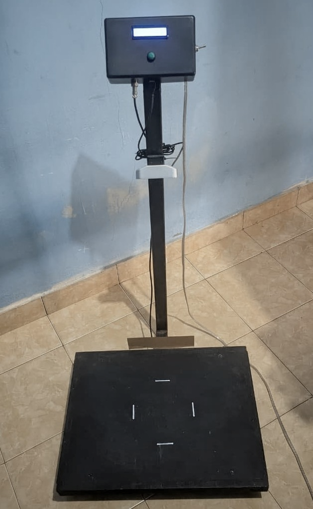

</div>

---

## Table of Contents

- [System Architecture](#system-architecture)
- [Hardware](#hardware)
- [Software & Libraries](#software--libraries)
- [Configuration & Security](#configuration--security)
- [Installation Guide](#installation-guide)
- [Auto-Boot (Systemd Service)](#auto-boot-systemd-service)
- [Standard Operating Procedure](#standard-operating-procedure)
- [Testing Documentation & Results](#testing-documentation--results)
- [Contributing & License](#contributing--license)
- [Authors](#authors)

---

## System Architecture

The system follows an **Input → Process → Output** approach: the load cell + HX711 (weight) and the webcam (image) serve as inputs; the Raspberry Pi CM4 handles weight conversion, filtering, and YOLOv5n inference; the output is shown on a 16×2 LCD, then transmitted to Google Sheets and forwarded to WhatsApp.

<div align="center">

**System Block Diagram**

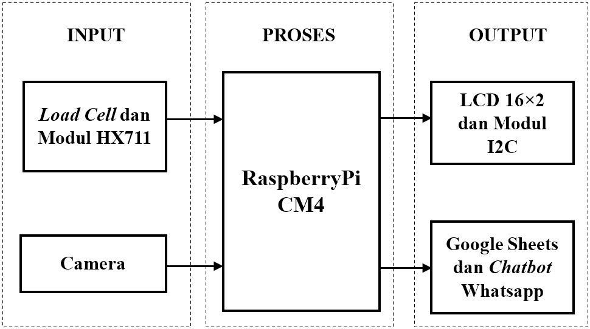

**Overall System Flowchart**

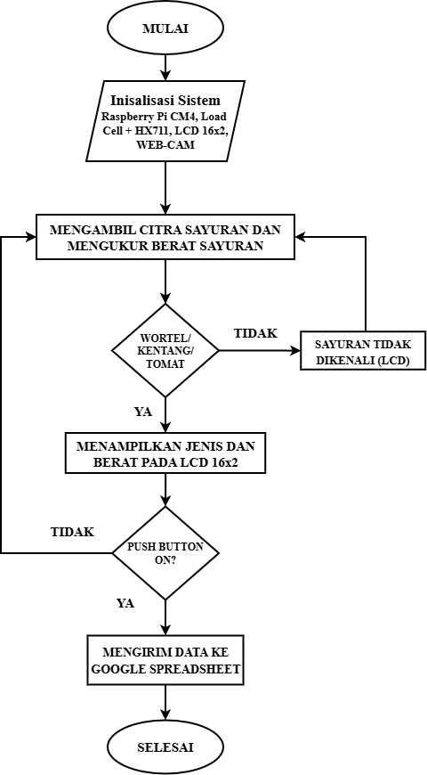

</div>

### Circuit & Wiring

| Overall Schematic | Wiring Diagram | PCB Design (Single Side) |
|:---:|:---:|:---:|
| 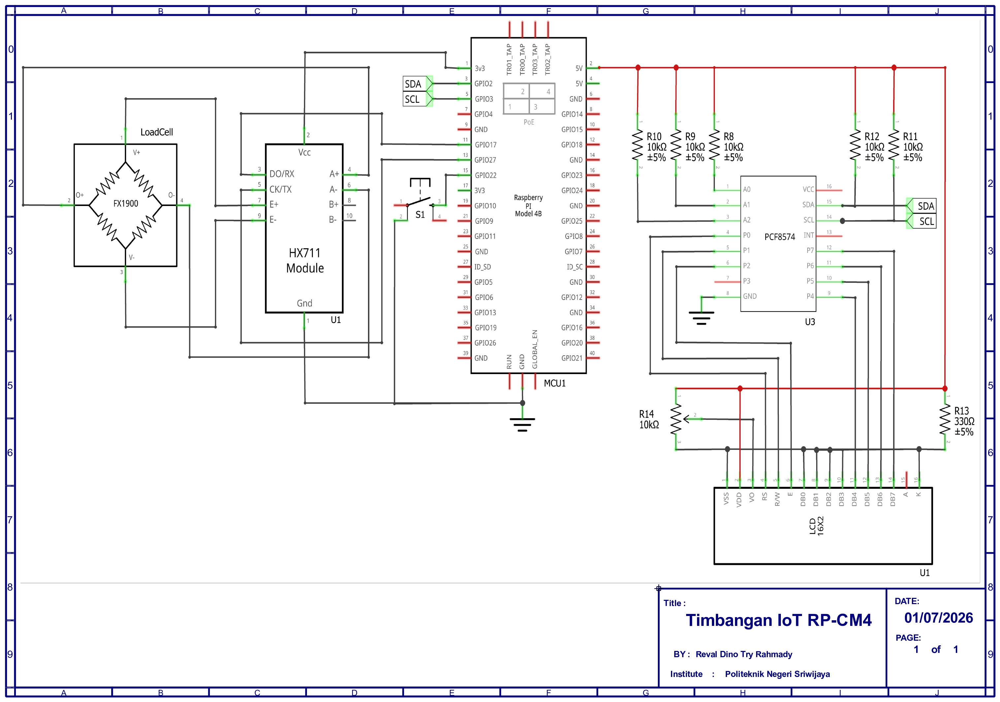 | 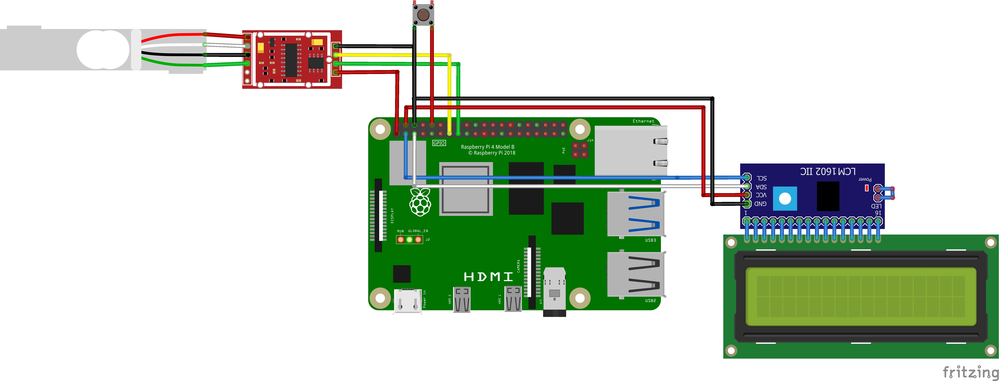 | 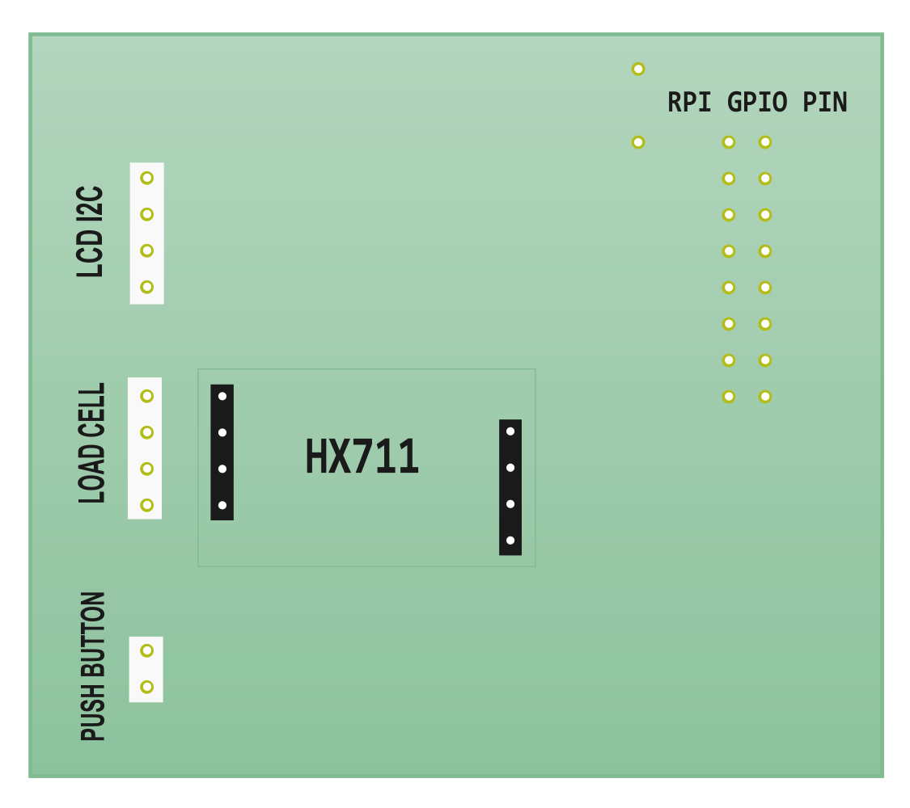 |

### Mechanical Design & Assembly

| 3D Sketch | Final Device Design |
|:---:|:---:|
| 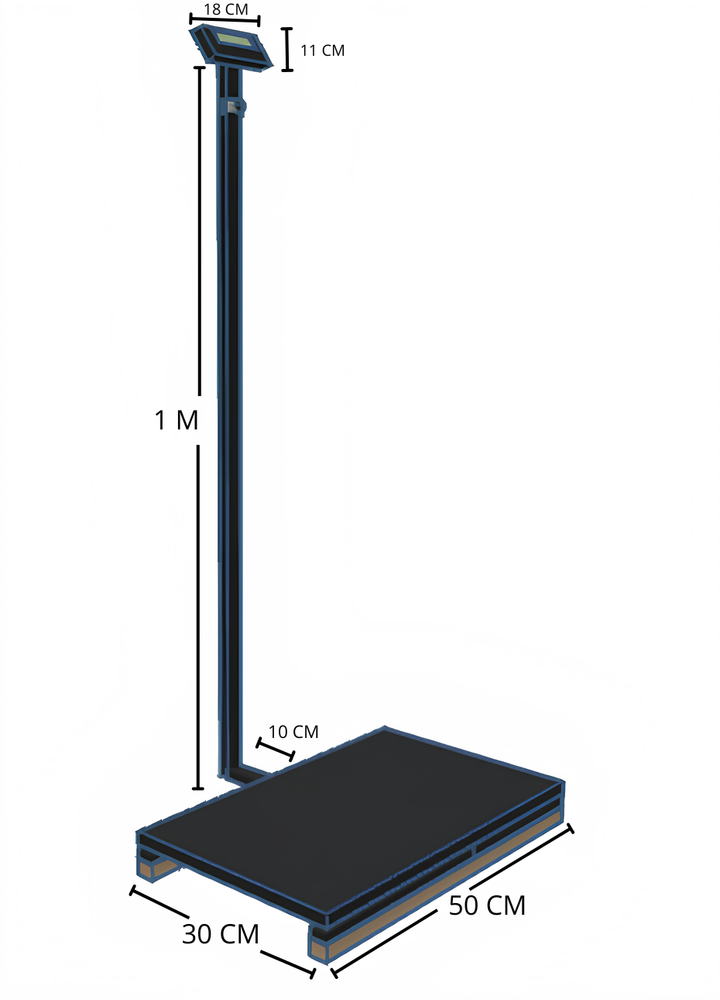 |  |

---

## Hardware

| Component | Specification |
|---|---|
| **Weight sensor** | Strain gauge load cell (Wheatstone full bridge) 180 kg, output 1.0–2.0 mV/V |
| **ADC module** | HX711, 24-bit |
| **Processing unit** | Raspberry Pi Compute Module 4 (64-bit, 2 GB LPDDR4 RAM, 32 GB eMMC) + CM4 I/O Base-A expansion board |
| **Visual sensor** | USB webcam (Micropack 1080p) |
| **Display** | 16×2 LCD + PCF8574 I2C module (address `0x27`), 5 V |
| **User input** | Active-low NO push button (GPIO22) + on/off toggle switch |
| **Power supply** | 5 VDC / 3 A adapter (input 110–220 VAC) |
| **Connectivity** | Wi-Fi modem (local network) |
| **PCB** | Single side (HX711 traces, load cell connector, LCD I2C, GPIO header) |
| **Mechanical** | 3 mm hollow steel frame (upper & lower), 50 × 30 cm plywood base, height ±1 m; component box 18.5 × 11.4 × 6.4 cm |

---

## Software & Libraries

### Project Structure

```text
timbangan-iot-rp4/
├── IoT/                             # Cloud-side configuration (not Raspberry Pi code)
│   ├── apps-script/
│   │   └── pb_to_sheets.gs          # Google Apps Script (doPost → Sheets + photo to Drive)
│   └── n8n/workflow/
│       └── manajemen-stok-sayur-wa-pin.n8n.json   # WhatsApp chatbot workflow + PIN
├── model/
│   └── best-fp16.tflite             # YOLOv5n model converted to TFLite FP16
├── captures/                        # Captured photos are stored here
├── logs/                            # Runtime logs are stored here
├── docs/
│   └── images/
│       ├── diagram/                 # Block diagrams & flowcharts
│       ├── wiring/                  # Schematics, wiring, PCB design
│       ├── alat/                    # 3D sketches & physical photos of the device
│       ├── hasil/                   # Testing, detection, chatbot & spreadsheet figures
│       └── penulis/                 # Author photos
├── scripts/                         # Python code running on the Raspberry Pi CM4
│   ├── common.py                    # Configuration + logger + shared state across threads
│   ├── thread_berat.py              # Weight reading thread (HX711 + Stable Lock filter), no IoT
│   ├── thread_jenis.py              # Vegetable type detection thread (YOLOv5 TFLite + webcam), no IoT
│   ├── IoT.py                       # Sends weight, type & photo to the cloud
│   ├── kalibrasi.py                 # Load cell calibration script (determines CALIBRATION_FACTOR)
│   └── uji_sistem.py                # Accuracy, precision & stability testing program
├── main.py                          # Integrated main program (weight + type + LCD + upload)
├── timbangan-iot.service            # systemd unit for auto-boot when the device powers on
├── .env.example                     # Credential template — copy it to .env
├── requirements.txt
└── README.md
```

> [!NOTE]
> **Naming convention:** the `IoT/` folder holds configuration that is *deployed to the cloud* (Apps Script & n8n), whereas `scripts/IoT.py` is the Python *client* on the Raspberry Pi that sends data there.

### Module Responsibilities

| Module | Role | Network | Hardware |
|---|---|:---:|---|
| `main.py` | GPIO program, LCD, splash, push button, start/stop threads | — | GPIO, LCD I2C |
| `scripts/common.py` | Configuration, logger, shared state, inter-thread signals | — | — |
| `scripts/thread_berat.py` | Weight acquisition + Stable Lock filter | — | HX711 |
| `scripts/thread_jenis.py` | YOLOv5n inference + local photo capture | — | Webcam |
| `scripts/IoT.py` | base64 encoding + POST to Apps Script | ✔ | — |

Three threads run in parallel and communicate through the shared state in `scripts/common.py`. The `thread_lcd_refresh` function in `main.py` is the **only** writer to the LCD, so no collisions occur on the I2C bus. Because `thread_berat.py` and `thread_jenis.py` never touch the network, both can be tested in isolation without an internet connection.

### Weight Filter — Stable Lock

Processing flow for each cycle (±0.5 seconds):

1. Five raw HX711 samples → discard the highest & lowest values → **trimmed median**
2. Zero **deadband** — readings below 20 g are treated as 0
3. **3-cycle rolling median**
4. **Stable Lock** — if 4 consecutive cycles fall within a ±200 g range, the value is locked like on a commercial scale
5. The lock releases automatically when the weight drops below 150 g (item lifted) or changes by more than 1 kg
6. **Auto-tare** after 120 seconds idle to correct drift

### Vision Model Training Pipeline

<div align="center">
  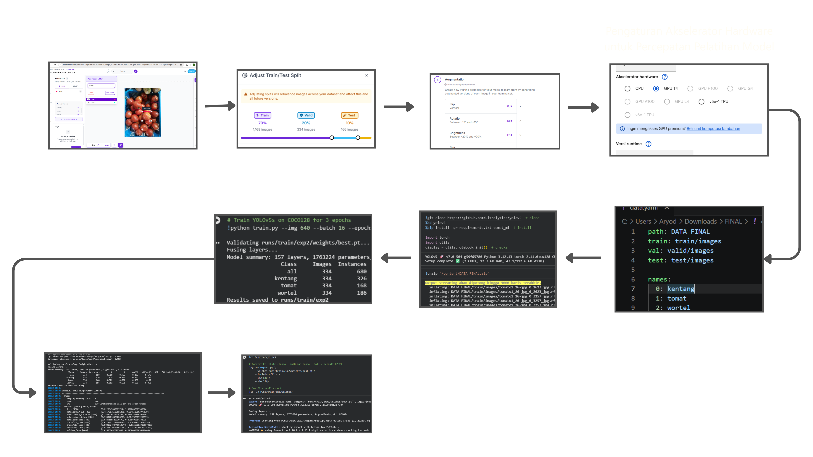
</div>

<details>
<summary><b>Expand the full YOLOv5n training workflow (8 stages)</b></summary>

<br>

**1. Dataset annotation in Roboflow**
Vegetable images are labeled with bounding boxes for the classes tomato, potato, and carrot using the Annotation Editor.

**2. Train/validation/test split**
The dataset is divided into 70 % training data (1,168 images), 20 % validation (334 images), and 10 % testing (166 images).

**3. Data augmentation**
Variation is added to the training data with vertical flip, rotation (−15° to +15°), and brightness shift (−20 % to +20 %) so the model becomes more robust.

**4. Hardware accelerator setup**
In Google Colab, the runtime is set to use a T4 GPU to speed up training.

**5. `data.yaml` configuration**
Defines the dataset paths (`train` / `valid` / `test` images) and the class list: `0 = kentang`, `1 = tomat`, `2 = wortel`.

**6. Training environment preparation**
Clone the YOLOv5 repository from GitHub, install the requirements (including `comet_ml`), then unzip the dataset (`DATA FINAL.zip`) into the Colab environment.

**7. Model training**
Run `train.py` with image size 640, batch 16, and a set number of epochs. Training results and the best weights (`best.pt`) are saved in `runs/train/exp2`.

**8. Validation and export**
The model is validated (mAP, precision, recall per class), then exported to TFLite format with `export.py` so it can run on mobile/embedded devices.

</details>

---

## Configuration & Security

The Google Apps Script ID is read from an environment variable via the `.env` file.

```bash
cp .env.example .env
nano .env
```

Minimum entries that must be changed:

| Variable | Description |
|---|---|
| `GOOGLE_SHEETS_SCRIPT_ID` | Taken from the deployment URL: `https://script.google.com/macros/s/`**`<SCRIPT_ID>`**`/exec` |
| `CALIBRATION_FACTOR` | Result of `scripts/kalibrasi.py` (this project: `24.1850`) |

Other optional variables (GPIO pins, LCD address, camera resolution, confidence threshold, LCD splash text) are available in `.env.example` together with their default values.

> [!TIP]
> **Offline mode.** If `GOOGLE_SHEETS_SCRIPT_ID` is left empty, the system still runs: weight and type appear on the LCD and photos are still saved to `captures/` — only the upload step is skipped.

> [!WARNING]
> Never commit `.env`, Apps Script credentials, or API tokens to the repository.

---

## Installation Guide

<details open>
<summary><b>Step 1–3 · Prepare the Raspberry Pi CM4</b></summary>

<br>

**1. Flash the OS to the CM4 eMMC**
Slide the I/O board switch to USB-C boot mode, connect it to a computer, run `rpiboot` so the eMMC is detected as a drive, then write the OS (Raspberry Pi OS / Ubuntu Server 22.04) along with the SSH configuration using **Raspberry Pi Imager**. Return the switch to normal mode and restart.

**2. Initial system configuration**
Run `sudo raspi-config` to enable **SSH** and the **I2C**/SPI interfaces, and to set Wi-Fi, time zone, and hostname.

**3. Connect VS Code Remote-SSH** to the Raspberry Pi for headless development.

</details>

<details open>
<summary><b>Step 4–6 · Install the software</b></summary>

<br>

**4. Clone the repository**

```bash
git clone https://github.com/revaldinotr/timbangan-iot-rp4
cd timbangan-iot-rp4
```

**5. Create a Python virtual environment** (optional, but recommended)

```bash
python3 -m venv venv
source venv/bin/activate
```

**6. Install dependencies**

```bash
pip3 install -r requirements.txt
```

</details>

<details open>
<summary><b>Step 7–9 · Wire and calibrate the hardware</b></summary>

<br>

**7. Assemble the hardware** according to the wiring diagram (HX711 → GPIO17/27, LCD I2C → SDA/SCL, push button → GPIO22, webcam → USB).

```bash
i2cdetect -y 1        # verify the LCD address
ls /dev/video*        # verify the camera
```

**8. Prepare the configuration file**

```bash
cp .env.example .env
nano .env
```

**9. Calibrate the load cell**

```bash
python3 scripts/kalibrasi.py
```

Follow the instructions (tare empty → place the 1.00 kg reference weight → record the `CALIBRATION_FACTOR`), then write the value into `.env` on the `CALIBRATION_FACTOR=` line.

</details>

<details open>
<summary><b>Step 10–12 · Set up the cloud services</b></summary>

<br>

**10. Deploy the Google Apps Script**
Copy `IoT/apps-script/pb_to_sheets.gs` into an Apps Script project bound to the Google Sheets file, deploy it as a web app, then fill in `GOOGLE_SHEETS_SCRIPT_ID` in `.env` with the ID from the deployment URL.

**11. Set up n8n + Cloudflare Tunnel**
Install Docker (`curl` installer, `sudo usermod -aG docker $USER`), run the n8n container, create a tunnel in the Cloudflare Zero Trust dashboard (Networks → Tunnels), point the public hostname to the n8n port, and run the connector command in the Raspberry Pi terminal.

**12. Import the n8n workflow**
Import `IoT/n8n/workflow/manajemen-stok-sayur-wa-pin.n8n.json`, then configure the Fonnte API, Google Sheets, and Groq credentials.

</details>

<details open>
<summary><b>Step 13–14 · Verify and run</b></summary>

<br>

**13. Verify each subsystem** (optional, but very helpful when troubleshooting)

```bash
python3 scripts/thread_berat.py                # check load cell & Stable Lock
python3 scripts/thread_jenis.py                # check webcam & model inference
python3 scripts/IoT.py foto.jpg 1.25 tomat     # check upload (can be run from a laptop)
python3 scripts/uji_sistem.py                  # Mode 1: Accuracy & Precision | Mode 2: Stability
```

**14. Run the main program**

```bash
python3 main.py
```

</details>

---

## Auto-Boot (Systemd Service)

So that the program runs automatically every time the Raspberry Pi is powered on — without having to SSH in first — it is registered as a **systemd service** using the provided `timbangan-iot.service` unit. This approach was chosen because it is the most reliable: it supports **auto-restart** if the application stops due to a crash, and it waits for the network to be ready before starting.

```bash
sudo cp timbangan-iot.service /etc/systemd/system/
sudo systemctl daemon-reload
sudo systemctl enable timbangan-iot.service     # enable auto-boot
sudo systemctl start  timbangan-iot.service     # start it now
```

```bash
systemctl status timbangan-iot.service          # check the service state
```

---

## Standard Operating Procedure

1. **Power on.** Flip the power supply toggle switch so the Raspberry Pi CM4 boots and automatically runs the script and the n8n service.
2. **Wait for initialization.** The LCD holds the `Menyiapkan sistem...` splash until the HX711 tare process and the YOLOv5n model loading are fully complete, so the first reading is never taken from a sensor that is not ready.
3. **Place the vegetables** on the scale platform, at the marked test point in the center of the base. The load cell reads the weight while the webcam scans the vegetable type; if the object is not recognized, the system rescans.

   <div align="center">
     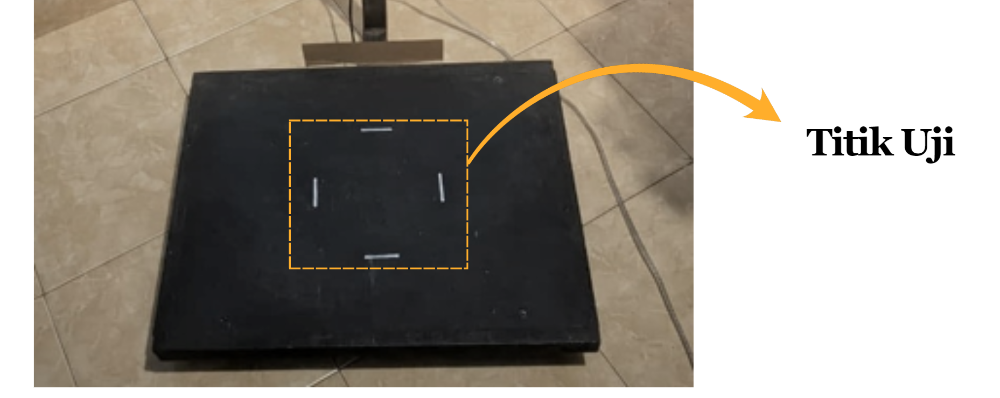
     <br><br>
     
   </div>

4. **Read the result.** The 16×2 LCD shows, for example, `Berat: 6.93 KG` and `Jenis: Tomat`. The value is locked automatically by Stable Lock once the reading settles, and releases by itself when the item is lifted.
5. **Send the data.** Press the push button — the LCD shows `Mengirim data.. / Mohon tunggu...`, then confirms with `TERKIRIM + FOTO!` once the weight, type, and photo are saved to Google Sheets & Drive.
6. **Monitor remotely.** Use the WhatsApp chatbot: type `LOGIN`, enter the PIN (session active for 60 minutes), then ask about stock, total incoming weight, vegetable types per day, revenue calculations, or request product photo attachments.
7. **Shut down.** Press `CTRL+C` in the terminal. The program performs a staged shutdown — LCD → camera → HX711 → GPIO — so no resource is left active.

---

## Testing Documentation & Results

### 1. Load Cell Calibration

| Parameter | Value |
|---|---:|
| ADC value with no load (tare) | 392,468 |
| ADC value with reference load | 416,653 |
| ADC value difference (N object − N tare) | 24,185 |
| Actual sensitivity | 2.0272 mV/V |
| Reference load mass | 1,000 grams (1.00 kg) |
| **Calibration factor (k)** | **24.1850** |

<div align="center">
  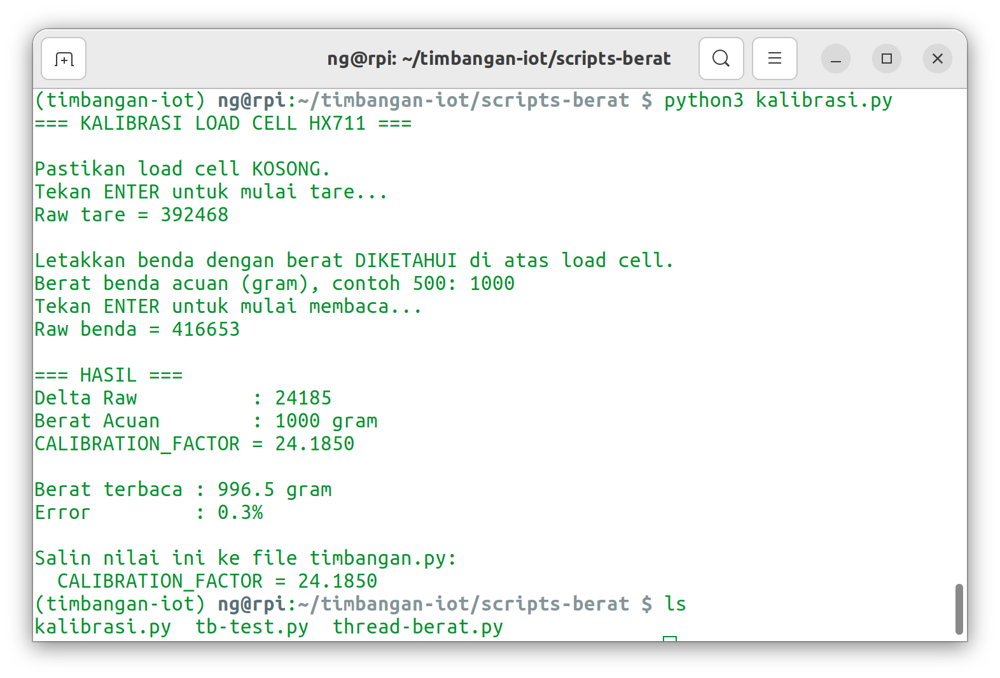
</div>

### 2. Accuracy & Precision Test

Seven reference loads, ten repetitions each.

| Ref (kg) | Mean (kg) | Error (%) | Std (kg) | RSD (%) | Accuracy (%) |
|---:|---:|---:|---:|---:|---:|
| 1.00 | 1.00 | 0.50 | 0.0053 | 0.52 | 99.50 |
| 5.00 | 5.01 | 0.12 | 0.0052 | 0.10 | 99.88 |
| 10.00 | 10.01 | 0.09 | 0.0032 | 0.03 | 99.91 |
| 15.00 | 14.99 | 0.05 | 0.0048 | 0.03 | 99.95 |
| 20.00 | 20.01 | 0.05 | 0.0057 | 0.03 | 99.95 |
| 25.00 | 25.01 | 0.04 | 0.0057 | 0.02 | 99.96 |
| 30.00 | 30.01 | 0.02 | 0.0165 | 0.05 | 99.98 |

| Accuracy vs Load | Error & RSD |
|:---:|:---:|
| 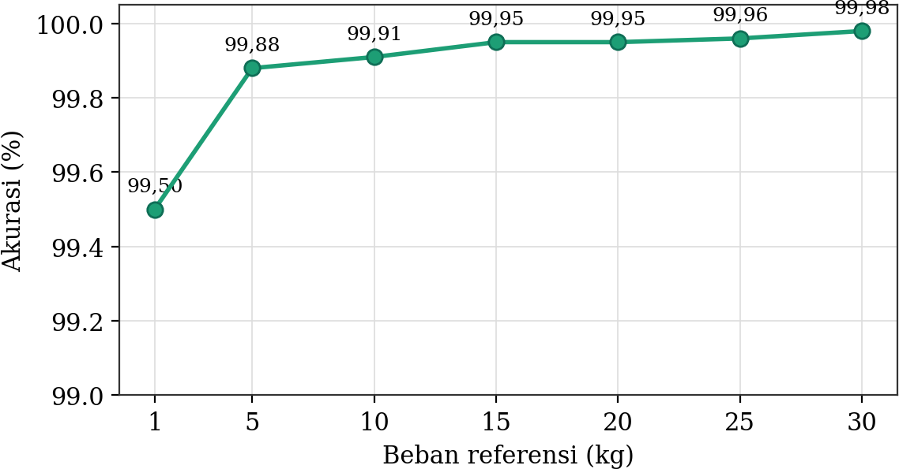 | 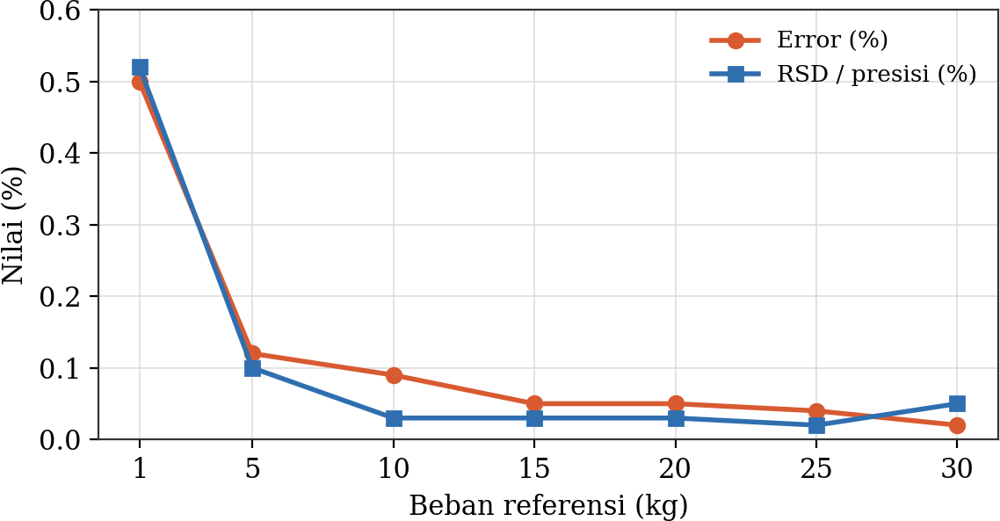 |

### 3. Stability Test

Constant load over 5–30 minutes: maximum drift of 0.01–0.02 kg with **no permanent drift or creep**; RSD 0.0229 %–0.4816 %; accuracy 99.70 %–99.99 %.

| Drift over Time | RSD over Time |
|:---:|:---:|
| 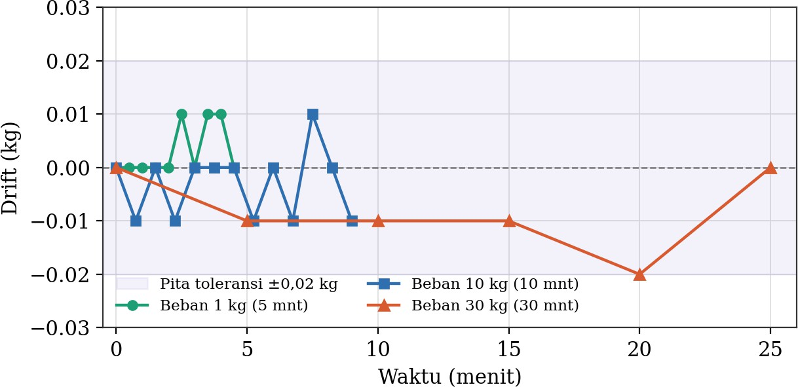 | 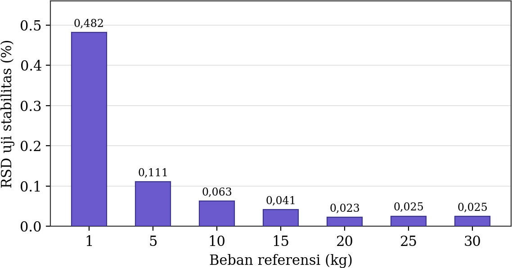 |

### 4. YOLOv5n Training & Detection

Dataset of 1,668 images (potato 575, tomato 684, carrot 409), 200 epochs, evaluated on 167 validation images:

| Class | Precision | Recall | mAP50 |
|---|---:|---:|---:|
| Potato | 74.3 % | 79.1 % | 83.7 % |
| Tomato | 93.2 % | 97.7 % | 98.3 % |
| Carrot | 73.8 % | 69.9 % | 72.1 % |
| **Overall** | **80.4 %** | **82.2 %** | **84.7 %** |

Real-time detection (TFLite FP16 on the CM4): **48/60 attempts successful (80 %)**, average confidence 80.6 %, speed **10–20 FPS** — tomato 90 %, potato 80 %, carrot 70 %.

<div align="center">
  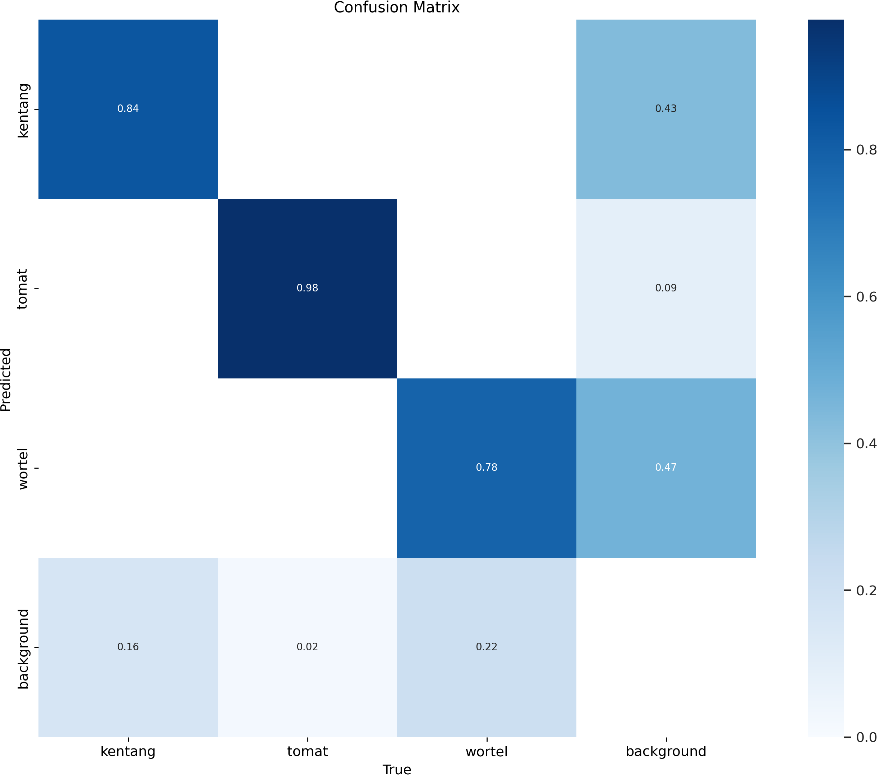
  <br><br>
  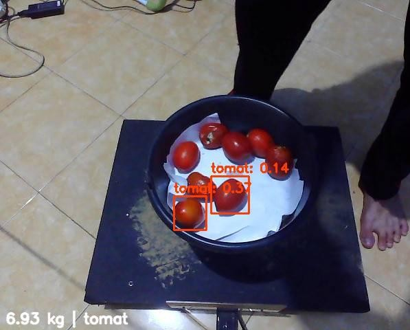
</div>

### 5. Cloud & Chatbot Integration

Testing was carried out by placing vegetable samples on the scale, waiting for the LCD to show a stable reading, then pressing the send button. The LCD flow proceeds in three stages: initial condition (`Berat: 6.93 KG` / `Jenis: Tomat`) → upload status (`Mengirim data.. / Mohon tunggu...`) while the weight, type, and captured photo are uploaded to Google Apps Script → success confirmation (`TERKIRIM + FOTO! 6.9kg Tomat`).

**Result: 13/15 attempts successful**, with a send time of 2–6 seconds; failures occurred only when Wi-Fi was disconnected or unstable.

| Weight & Type | Sending | Successfully Sent |
|:---:|:---:|:---:|
| 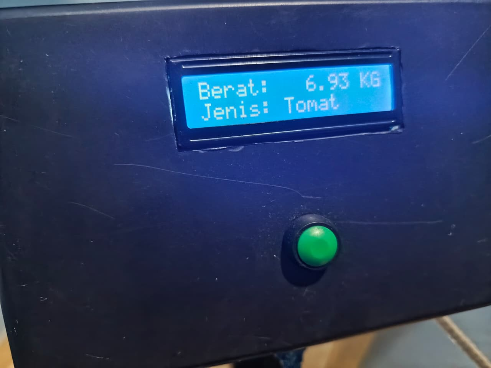 | 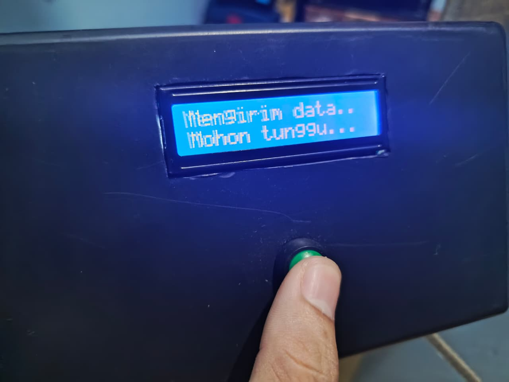 | 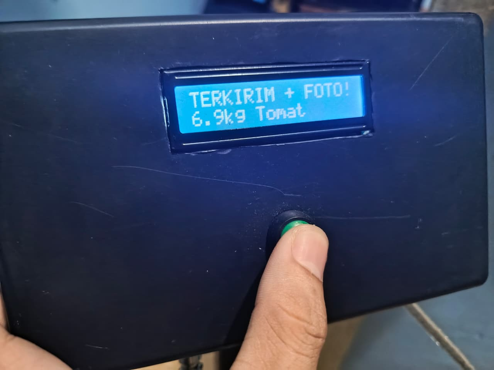 |

<div align="center">
  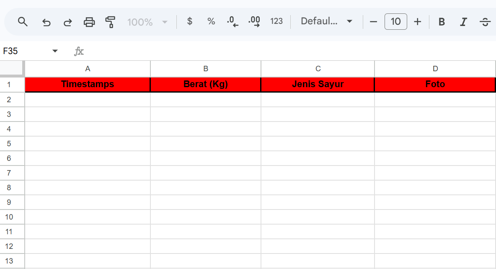
</div>

The vegetable stock data in Google Sheets is read automatically by the n8n workflow through the Google Sheets API every time a user sends a question to the WhatsApp chatbot, so the LLM's answers always reflect the latest stock conditions. The workflow integrates the Fonnte API, an n8n webhook, Google Sheets, PIN authentication, and Groq LLaMA 3.3 70B.

<div align="center">
  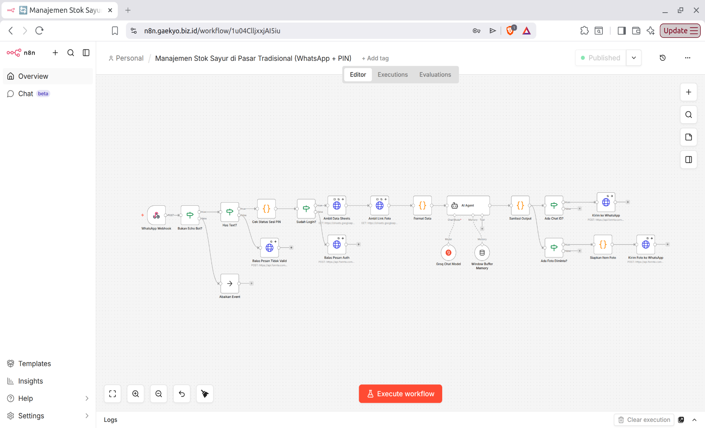
</div>

When the Raspberry Pi has just been connected to power and Wi-Fi, the system goes through an initialization process — booting the OS, starting the n8n Docker container, and establishing the Cloudflare Tunnel connection — with a total delay of roughly ±2 minutes before the system is ready to use. This was confirmed during testing, where messages sent at 9:18 PM and 9:19 PM only received a response at 9:20 PM. The response then displayed the complete PIN authentication flow: the notification that the user was not yet logged in, the instruction to type `LOGIN`, the PIN request, and finally the confirmation of a successful login with a session active for 60 minutes.

<div align="center">
  
</div>

The chatbot is able to:

- answer vegetable stock availability in real time, complete with weight details and the recording timestamp;
- understand follow-up questions, such as calculating total incoming weight, identifying the vegetable types on a particular day, and even estimating potential revenue when the user provides a selling price;
- respect data boundaries by answering honestly when a question falls outside the scope of the spreadsheet (for example purchase price or profit), while offering relevant alternative calculations;
- send product photos from Google Drive along with the complete stock list when requested.

| Response Test #1 | Response Test #2 | Response Test #3 |
|:---:|:---:|:---:|
| 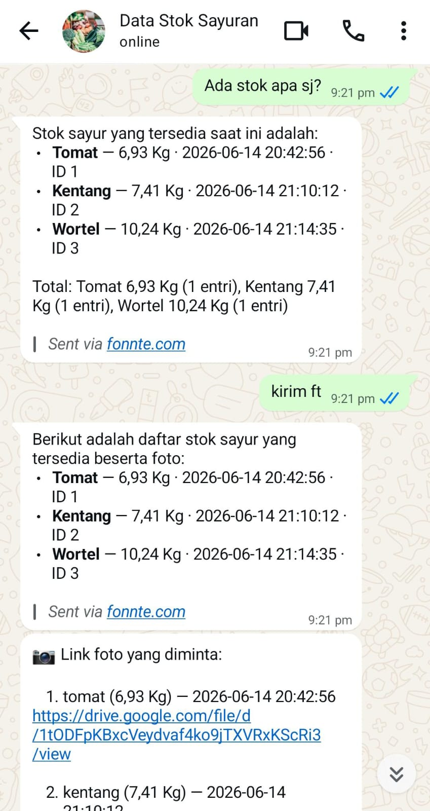 | 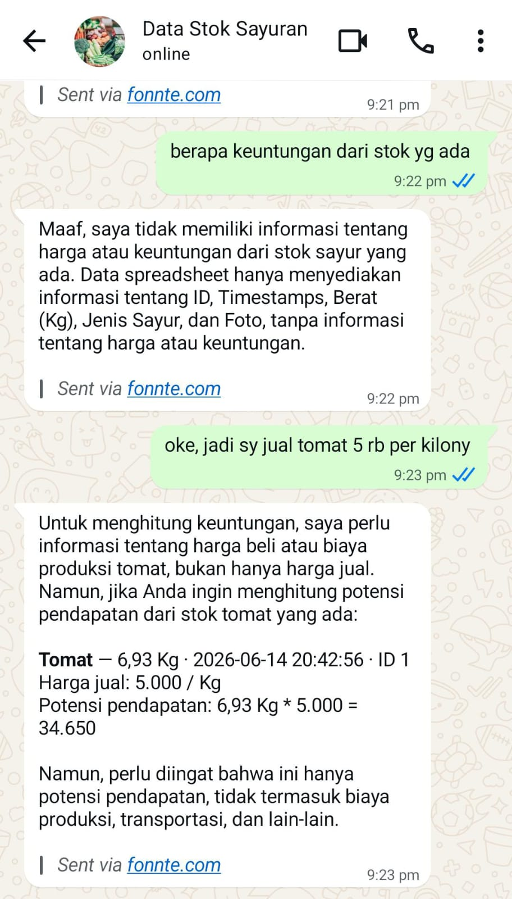 | 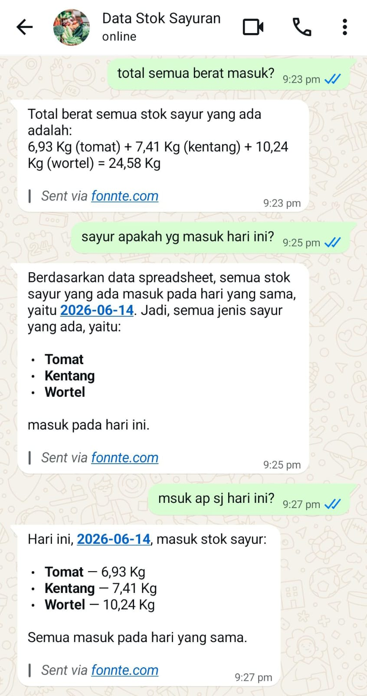 |

---

## Roadmap

Directions for further development, as recommended in the final report:

| Area | Planned Improvement |
|---|---|
| **Field validation** | Direct testing in a traditional market environment; load testing up to the full 180 kg capacity |
| **Mechanics** | Vibration damping on the load cell mount |
| **Compute** | Upgrade to a Raspberry Pi 5 (4–8 GB RAM) |
| **Vision model** | Expand and balance the dataset (carrot & potato), apply focal loss, migrate to YOLOv8 / YOLOv11 |
| **Reliability** | Local data queue for when the connection drops |
| **Features** | Vegetable quality/freshness detection; web dashboard and mobile app for stock management |

---

## Contributing & License

Contributions are welcome. Please fork this repository, create a feature branch, then submit a pull request.

> [!IMPORTANT]
> Do not include the `.env` file, Apps Script credentials, or API tokens in a pull request.

This project is an **academic Final Project** of Politeknik Negeri Sriwijaya and is published for **educational and reference purposes**. Please give attribution to the authors when using code or documentation from this repository.

---

## Authors

<table>
  <thead>
    <tr>
      <th align="center">Photo</th>
      <th align="left">Author</th>
      <th align="left">Subsystem</th>
    </tr>
  </thead>
  <tbody>
    <tr>
      <td align="center"></td>
      <td align="left"><a href="https://www.linkedin.com/in/revaldino"><b>Reval Dino Try Rahmady</b></a></td>
      <td align="left">Weight Data Acquisition System (Load Cell + HX711 + IoT)</td>
    </tr>
    <tr>
      <td align="center"></td>
      <td align="left"><a href="https://www.linkedin.com/in/aryo-dwi-cahyo-94566a3a5"><b>Aryo Dwi Cahyo</b></a></td>
      <td align="left">Intelligent Vegetable Type Sorter (YOLOv5n + Computer Vision)</td>
    </tr>
  </tbody>
</table>

<div align="center">
<br>

**Repository:** [github.com/revaldinotr/timbangan-iot-rp4](https://github.com/revaldinotr/timbangan-iot-rp4)

<sub>Politeknik Negeri Sriwijaya · Final Project</sub>

</div>
